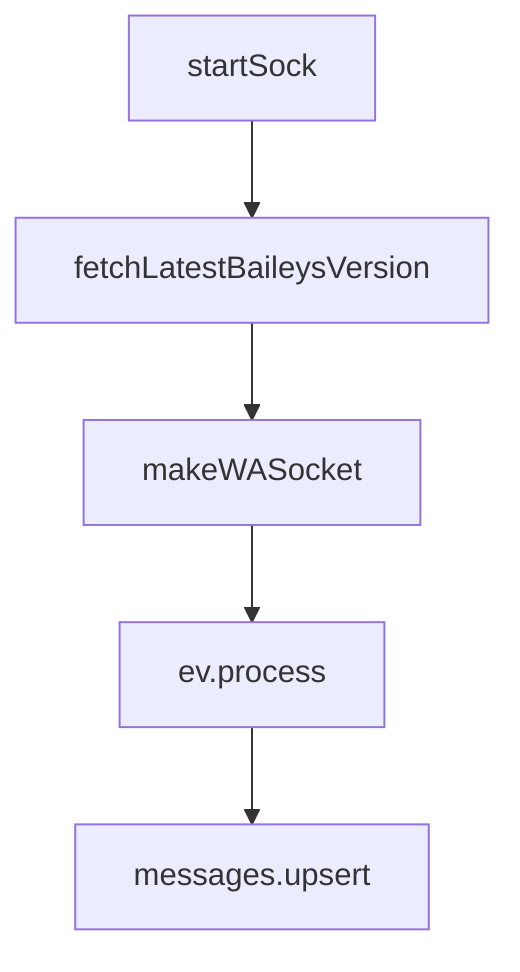

# Directorio Example

Incluye un ejemplo práctico que demuestra cómo iniciar la sesión con Baileys, manejar eventos y enviar mensajes automáticos.

## Diagrama de flujo del ejemplo

```mermaid
flowchart TD
    A[startSock] --> B[fetchLatestBaileysVersion]
    B --> C[makeWASocket]
    C --> D[ev.process]
    D --> E[messages.upsert]
```
