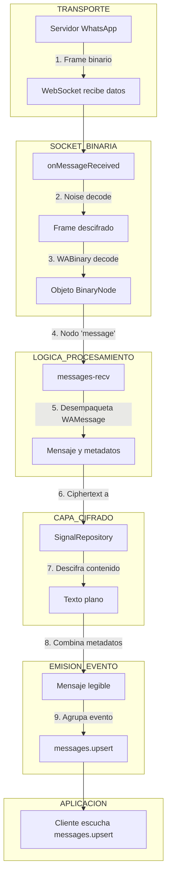

[🏠 Volver al Índice](../../src/navigation.md) | [📋 Índice de Eventos](./readme.md)

---

# Evento: Recibir un Mensaje

Este documento describe el flujo de eventos y la lógica involucrada cuando Baileys recibe un mensaje de WhatsApp desde el servidor.

## Diagrama de Flujo

## Explicación Detallada del Flujo

1.  **Recepción de Datos**: El `WebSocketClient` recibe un `Buffer` de datos binarios del servidor de WhatsApp.

2.  **Descifrado de Frame (Noise)**:
    - El evento `message` del WebSocket es capturado por el manejador `onMessageReceived` en `socket.ts`.
    - Lo primero que hace es pasar el buffer al `noise.decodeFrame()`. El protocolo Noise cifra toda la comunicación, por lo que este paso es necesario para obtener el `BinaryNode` real que envió el servidor.

3.  **Decodificación Binaria (`WABinary`)**:
    - El frame descifrado (que sigue siendo un buffer) se pasa a la función `decodeBinaryNode` del módulo `WABinary`.
    - Esta función deserializa el buffer y lo convierte en un objeto `BinaryNode` estructurado, que la aplicación puede interpretar.

4.  **Identificación del Nodo**:
    - La lógica en `socket.ts` (o delegada a `messages-recv.ts`) inspecciona la `tag` del nodo. Si es "message", sabe que ha recibido un mensaje de chat.

5.  **Desempaquetado del Mensaje**:
    - La lógica en `messages-recv.ts` (probablemente a través de `decodeWAMessage`) desempaqueta el `BinaryNode` para extraer la estructura `proto.IWebMessageInfo`, que contiene el `ciphertext` (el contenido cifrado) y todos los metadatos (remitente, timestamp, etc.).

6.  **Descifrado del Contenido (`SignalRepository`)**:
    - El `ciphertext` se pasa al método `decryptMessage` o `decryptGroupMessage` del `SignalRepository`.
    - El repositorio utiliza la librería `libsignal` o `GroupCipher` para descifrar el contenido del mensaje, convirtiéndolo en texto plano (o en los bytes originales del archivo multimedia).

7.  **Ensamblaje Final**:
    - El contenido ya descifrado se vuelve a colocar en la estructura del mensaje.
    - Se pueden realizar procesamientos adicionales en `process-message.ts` para estandarizar el mensaje.

8.  **Emisión del Evento**:
    - Finalmente, el mensaje completo y legible se agrupa dentro de un evento (en este caso, `messages.upsert`).
    - El emisor de eventos (`ev`) de Baileys emite este evento.

9.  **Recepción por el Cliente**:
    - El código de la aplicación cliente, que está escuchando eventos con `sock.ev.on('messages.upsert', ...)`, recibe el evento con los nuevos mensajes y puede actuar en consecuencia.
