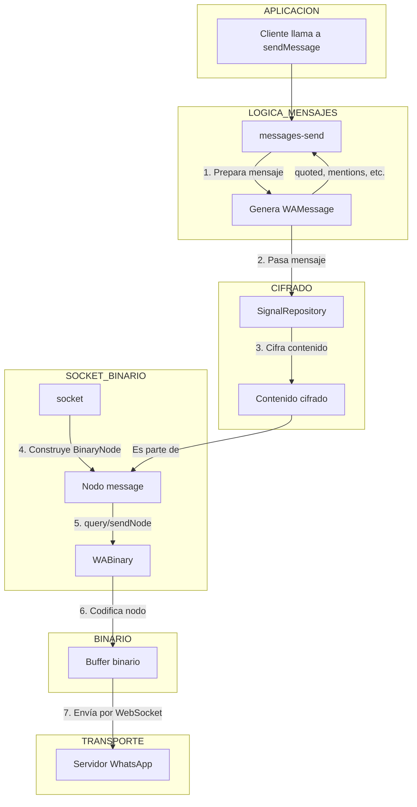

[🏠 Volver al Índice](../../src/navigation.md) | [📋 Índice de Eventos](./readme.md)

---

# Evento: Enviar un Mensaje

Este documento describe el flujo de eventos y la lógica involucrada cuando un cliente de Baileys envía un mensaje usando la función `sendMessage`.

## Diagrama de Flujo

## Explicación Detallada del Flujo

1.  **Llamada a la API**: El proceso comienza cuando el código del cliente llama a la función de alto nivel `sendMessage`, proporcionando el JID del destinatario y el contenido del mensaje (texto, imagen, etc.).

2.  **Preparación del Mensaje (`messages-send.ts`)**:
    - La lógica en `messages-send.ts` toma el contenido simple y lo convierte en una estructura de mensaje de WhatsApp completa (`proto.IWebMessageInfo`).
    - Procesa opciones adicionales como citar un mensaje (`quoted`), añadir menciones (`mentions`), etc., y las incorpora a la estructura del mensaje.

3.  **Cifrado (`SignalRepository`)**:
    - El mensaje preparado se pasa al `SignalRepository`.
    - Se determina si es un mensaje individual o de grupo.
    - Se llama al método correspondiente (`encryptMessage` o `encryptGroupMessage`).
    - El `SignalRepository` utiliza la librería `libsignal` (para 1-a-1) o la lógica de `GroupCipher` (para grupos) para cifrar el contenido del mensaje. El resultado es el `ciphertext`.

4.  **Construcción del Nodo Binario (`socket.ts`)**:
    - Con el contenido ya cifrado, la lógica en `socket.ts` construye el `BinaryNode` final que se enviará al servidor.
    - Este nodo tiene la etiqueta (`tag`) "message" y contiene el `ciphertext` junto con otros metadatos necesarios.

5.  **Envío a través del Socket**:
    - Se utiliza una de las funciones de envío del socket, como `query` (si se espera una respuesta) o `sendNode` (si no).

6.  **Codificación Binaria (`WABinary`)**:
    - La función de envío del socket pasa el `BinaryNode` al módulo `WABinary`.
    - `encodeBinaryNode` serializa el objeto de nodo en un `Buffer` de bytes, utilizando las optimizaciones de tokenización y empaquetado.

7.  **Transmisión**:
    - El `Buffer` binario final se envía a través de la conexión WebSocket a los servidores de WhatsApp para su entrega.
