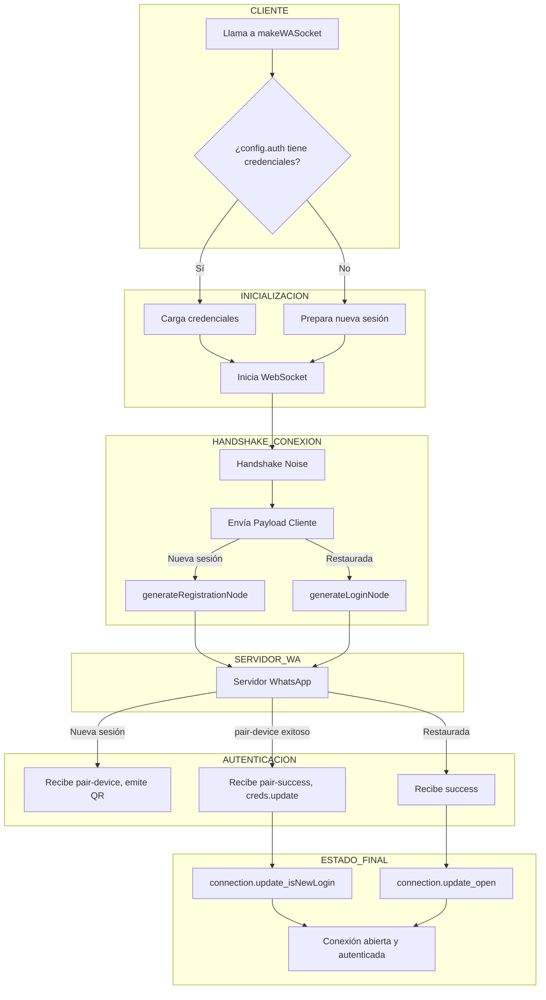

[🏠 Volver al Índice](../../src/navigation.md) | [📋 Índice de Eventos](./readme.md)

---

# Evento: Creación o Restauración de una Sesión

Este documento describe el flujo de eventos y la lógica involucrada cuando un cliente de Baileys se conecta a WhatsApp, ya sea para iniciar una nueva sesión (requiere QR/código) o para restaurar una sesión existente.

## Diagrama de Flujo

## Explicación Detallada del Flujo

1.  **Inicio**: El proceso comienza cuando la aplicación cliente llama a `makeWASocket(config)`. El `config` puede contener opcionalmente un objeto `auth` con el estado de una sesión anterior.

2.  **Inicialización del Socket**:
    - `makeSocket` (en `socket.ts`) es llamado.
    - Se crea una instancia del `WebSocketClient` y se inicia la conexión.
    - Se prepara el manejador de `Noise` para el cifrado del handshake.
    - Se crea el `SignalRepository` para el cifrado de mensajes.

3.  **Handshake de Noise**:
    - Una vez que el WebSocket se abre, se inicia el `validateConnection`.
    - El cliente y el servidor intercambian mensajes de `HandshakeMessage` para establecer un canal de comunicación cifrado usando el protocolo Noise. Esto asegura que la autenticación no ocurra en texto plano.

4.  **Login o Registro**:
    - Una vez que el canal es seguro, Baileys envía un `ClientPayload`.
    - **Si no hay credenciales (`creds.me` no existe)**, se considera una **nueva sesión**. Se envía un nodo de registro (`generateRegistrationNode`).
    - **Si hay credenciales**, se considera una **restauración de sesión**. Se envía un nodo de inicio de sesión (`generateLoginNode`) con el JID del usuario.

5.  **Procesamiento del Servidor y Respuesta**:
    - El servidor de WhatsApp procesa la solicitud.
    - **Para una nueva sesión**: El servidor responde con un nodo `pair-device`. Baileys recibe esto, extrae las referencias para el código QR y emite el evento `connection.update` con el `qr`. El cliente debe mostrar este QR.
    - **Escaneo del QR**: Cuando el usuario escanea el QR, el servidor lo detecta y envía un nodo `pair-success`. Baileys lo recibe, configura las nuevas credenciales (`me`, `platform`, etc.), emite un `creds.update` para que el cliente las guarde, y finalmente emite `connection.update` con `isNewLogin: true`. La conexión generalmente se reinicia en este punto.
    - **Para una sesión restaurada**: Si el `login` es exitoso, el servidor envía un nodo `success`.

6.  **Conexión Establecida**:
    - Al recibir el `success`, Baileys sabe que la conexión está completamente autenticada y operativa.
    - Realiza algunas tareas finales, como subir "pre-keys" si es necesario (`uploadPreKeysToServerIfRequired`).
    - Emite el evento final `connection.update` con el estado `{ connection: 'open' }`.

A partir de este punto, la aplicación está lista para enviar y recibir mensajes.
