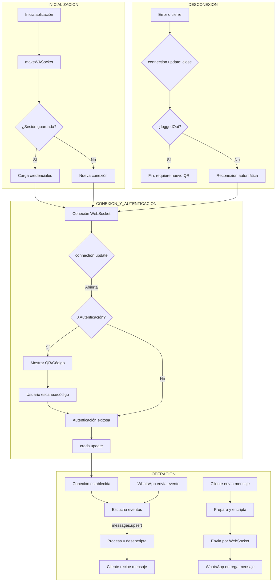

[🏠 Volver al Índice](../src/navigation.md) | [📋 Índice de Eventos](./events/readme.md)

---

# Diagrama de Flujo del Proyecto

Este documento contiene un diagrama de Mermaid que ilustra el flujo general de la aplicación Baileys, desde la inicialización hasta la interacción con WhatsApp.

## Explicación del Flujo

1.  **Inicialización**: El proceso comienza cuando una aplicación cliente crea una instancia de Baileys usando `makeWASocket`. La librería comprueba si existen credenciales de una sesión anterior. Si es así, las carga; de lo contrario, se prepara para una nueva autenticación.

2.  **Conexión y Autenticación**:
    *   Se establece una conexión WebSocket con los servidores de WhatsApp.
    *   Si es una nueva sesión, se genera un código QR o un código de emparejamiento que el usuario debe escanear con su teléfono.
    *   Una vez autenticado, Baileys recibe las credenciales de sesión. Es fundamental guardarlas (`creds.update`) para poder restaurar la sesión en el futuro sin necesidad de volver a escanear el código.

3.  **Operación**:
    *   Con la conexión activa, la librería se pone en modo de escucha de eventos. Los eventos más importantes son `messages.upsert` (para nuevos mensajes) y `connection.update` (para cambios en el estado de la conexión).
    *   **Mensaje Entrante**: Cuando llega un mensaje, el evento `messages.upsert` se dispara. Baileys desencripta el contenido y lo entrega a la aplicación cliente.
    *   **Mensaje Saliente**: La aplicación cliente utiliza funciones como `sock.sendMessage()` para enviar mensajes. Baileys se encarga de encriptar el contenido y enviarlo a través del WebSocket.

4.  **Desconexión**:
    *   Si la conexión se cierra, el evento `connection.update` lo notifica.
    *   La librería analiza la causa. Si el usuario cerró la sesión (`DisconnectReason.loggedOut`), el proceso termina.
    *   Si fue por un error de red u otra causa recuperable, Baileys intentará reconectarse automáticamente para mantener la sesión activa.
