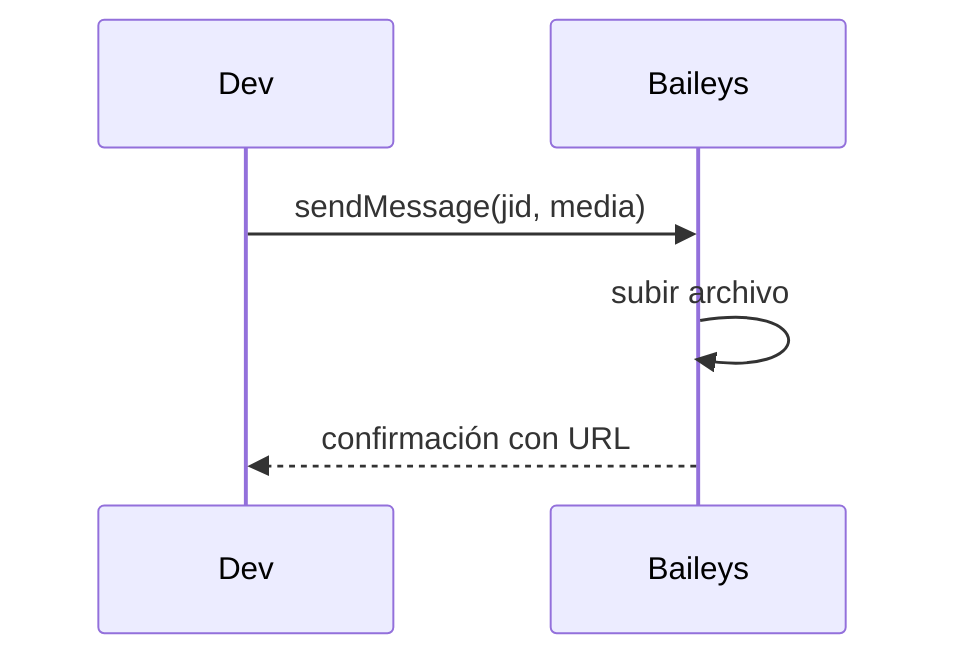

# Evento: envío de archivo

1. Se prepara el contenido del archivo (imagen, video, documento, etc.).
2. Se invoca `sendMessage` con un objeto que describe el tipo de medio y sus datos.
3. Baileys maneja la subida del archivo y envía la notificación al destinatario.

## Diagrama de flujo

