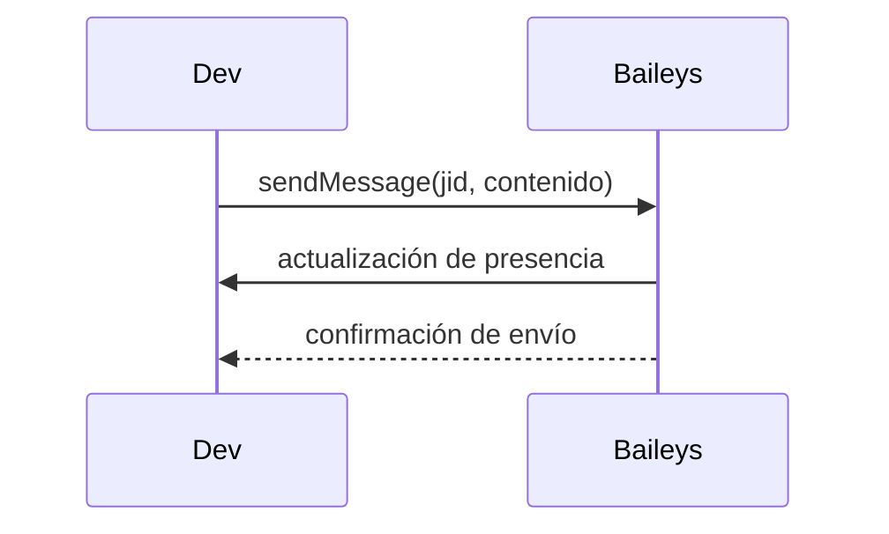

# Evento: envío de mensaje

1. Con una sesión activa, se llama a `sendMessage` indicando el JID destino y el contenido.
2. Baileys actualiza la presencia a "composing" y luego "paused" para simular escritura.
3. El mensaje se envía por el socket y el servidor responde con la confirmación correspondiente.

## Diagrama de flujo

