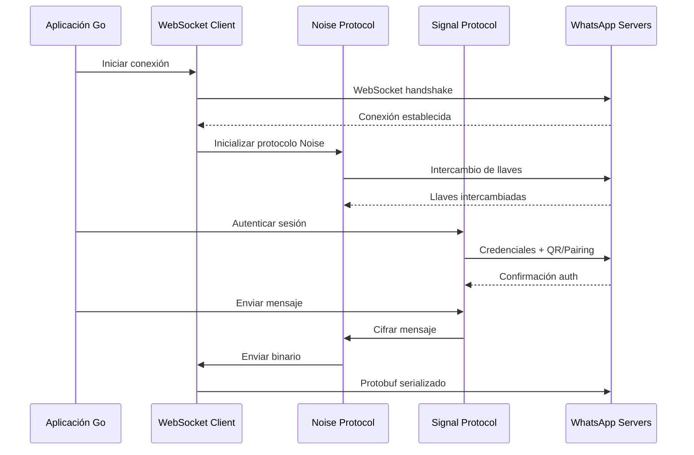

# Análisis de Tecnologías Core - Baileys

## Objetivo del Análisis

Este documento analiza las tecnologías principales utilizadas en Baileys (Node.js/TypeScript) para evaluar la viabilidad de migración a Go y identificar las librerías equivalentes necesarias.

## Stack Tecnológico Principal

### 1. **Comunicación WebSocket**
- **Node.js**: `ws` v8.13.0 - Cliente WebSocket nativo
- **Uso**: Conexión directa con WhatsApp Web servers
- **Go Equivalente**: 
  - `github.com/gorilla/websocket` (Más popular)
  - `github.com/gobwas/ws` (Más performante)
  - `nhooyr.io/websocket` (Más moderno)

### 2. **Protocol Buffers**
- **Node.js**: `protobufjs` v7.2.4 - Serialización de mensajes
- **Uso**: Comunicación binaria con WhatsApp servers
- **Go Equivalente**: 
  - `google.golang.org/protobuf` (Oficial)
  - Generación automática con `protoc-gen-go`

### 3. **Criptografía Signal Protocol**
- **Node.js**: `libsignal` (fork customizado de WhiskeySocket)
- **Uso**: Cifrado E2E, autenticación, gestión de llaves
- **Go Equivalente**: 
  - **CRÍTICO**: No existe port directo oficial
  - Opciones: 
    - `github.com/signal-golang/textsecure` (Incompleto)
    - Implementación propia usando `crypto/` estándar
    - Wrapper CGO con libsignal-c

### 4. **Cache & Almacenamiento**
- **Node.js**: 
  - `@cacheable/node-cache` v1.4.0 - Cache en memoria
  - Sistema de archivos JSON para persistencia
- **Go Equivalente**:
  - `github.com/patrickmn/go-cache` - Cache en memoria
  - `github.com/allegro/bigcache` - Cache de alto rendimiento
  - **SQLite**: `github.com/mattn/go-sqlite3` + `database/sql`

### 5. **Logging**
- **Node.js**: `pino` v9.6 - Logger estructurado de alto rendimiento
- **Go Equivalente**:
  - `github.com/rs/zerolog` (Más rápido)
  - `github.com/sirupsen/logrus` (Más popular)
  - `slog` (Estándar Go 1.21+)

## Arquitectura de Comunicación

## Dependencias Críticas vs Go

| Funcionalidad | Node.js | Go Equivalente | Complejidad |
|---------------|---------|----------------|-------------|
| WebSocket | `ws` | `gorilla/websocket` | ✅ Fácil |
| Protobuf | `protobufjs` | `protobuf` | ✅ Fácil |
| HTTP Client | `axios` | `net/http` | ✅ Fácil |
| Crypto básico | `crypto` | `crypto/*` | ✅ Fácil |
| Signal Protocol | `libsignal` | **❌ No existe** | 🔴 Crítico |
| Cache | `node-cache` | `go-cache` | ✅ Fácil |
| File System | `fs/promises` | `os`, `io` | ✅ Fácil |
| Mutex/Locks | `async-mutex` | `sync.Mutex` | ✅ Nativo |
| Eventos | EventEmitter | `channel` + goroutines | ✅ Mejor en Go |

## Desafíos de Migración

### 🔴 **CRÍTICO: Signal Protocol**
- **Problema**: No existe implementación completa en Go
- **Soluciones posibles**:
  1. **CGO Wrapper**: Usar libsignal-c con bindings CGO
  2. **Implementación propia**: Recrear algoritmos Signal desde cero
  3. **Híbrido**: Componentes críticos con CGO, resto nativo

### 🟡 **MEDIO: Noise Protocol**
- WhatsApp usa protocolo Noise personalizado
- Requiere implementación específica para WA

### 🟢 **FÁCIL: Resto del stack**
- WebSocket, HTTP, JSON, archivos → Go nativo
- Mejor rendimiento esperado en Go

## Análisis de Rendimiento Esperado

| Aspecto | Node.js | Go Esperado | Mejora |
|---------|---------|-------------|--------|
| Memoria | ~50-100MB | ~10-30MB | 70%+ |
| CPU | Interpretado | Compilado | 300%+ |
| Concurrencia | Event Loop | Goroutines | 500%+ |
| Startup | ~1-2s | ~0.1s | 90%+ |
| Distribución | Runtime + deps | Binario único | Infinita |

## Recomendaciones

### 1. **Estrategia de Migración**
- **Fase 1**: Core (WebSocket, Protobuf, básicos)
- **Fase 2**: Signal Protocol (decisión crítica)
- **Fase 3**: Features avanzadas

### 2. **Decisión Signal Protocol**
Recomendar **CGO + libsignal-c**:
- ✅ Compatibilidad 100% garantizada
- ✅ Mantenimiento WhatsApp/Signal
- ❌ Dependencia C/C++
- ❌ Cross-compilation compleja

### 3. **Mejoras Arquitectónicas**
- **SQLite** en lugar de archivos JSON
- **Configuración** vía variables de entorno
- **Logging estructurado** con niveles
- **Métricas** integradas (Prometheus)
- **Graceful shutdown** nativo

## Próximos Pasos

1. **Investigar Signal Protocol** en detalle
2. **Analizar sistema de autenticación** específico
3. **Revisar protocolos Noise** implementation
4. **Evaluar compatibilidad** de protobuf schemas
5. **Diseñar arquitectura** Go propuesta