# Sistema de Autenticación - Análisis para Migración

## Visión General

El sistema de autenticación de Baileys implementa múltiples capas de seguridad y manejo de credenciales que son fundamentales para la comunicación con WhatsApp Web.

## Arquitectura de Autenticación


## Componentes Críticos

### 1. **Credenciales de Autenticación (`AuthenticationCreds`)**

```typescript
interface AuthenticationCreds {
    // Signal Protocol Core
    readonly signedIdentityKey: KeyPair       // Identidad permanente del dispositivo
    readonly signedPreKey: SignedKeyPair      // Llave pre-firmada para sesiones
    readonly registrationId: number           // ID único del registro
    
    // Noise Protocol (WhatsApp específico)
    readonly noiseKey: KeyPair                // Llave para protocolo Noise
    readonly pairingEphemeralKeyPair: KeyPair // Para pairing code
    
    // Configuración de cuenta
    advSecretKey: string                      // Clave secreta avanzada
    me?: Contact                              // Información del usuario
    account?: ADVSignedDeviceIdentity         // Identidad firmada del dispositivo
    
    // Estado de sincronización
    firstUnuploadedPreKeyId: number           // Control de llaves pre-cargadas
    nextPreKeyId: number                      // Siguiente ID de PreKey
    accountSyncCounter: number                // Contador de sincronizaciones
    
    // Códigos y rutas
    pairingCode: string | undefined           // Código de emparejamiento actual
    routingInfo: Buffer | undefined           // Información de enrutamiento
}
```

### 2. **Gestión de Llaves Signal (`SignalKeyStore`)**

Almacena diferentes tipos de llaves criptográficas:

```typescript
type SignalDataTypeMap = {
    'pre-key': KeyPair                        // Llaves públicas pre-generadas
    'session': Uint8Array                     // Sesiones activas cifradas
    'sender-key': Uint8Array                  // Llaves para mensajes de grupo
    'sender-key-memory': { [jid: string]: boolean }  // Cache de llaves de grupo
    'app-state-sync-key': AppStateSyncKeyData // Llaves para sincronización de estado
    'app-state-sync-version': LTHashState     // Versiones de sincronización
}
```

### 3. **Flujo de Autenticación con QR**

```mermaid
sequenceDiagram
    participant Client as Cliente Go
    participant WA as WhatsApp Web
    participant Phone as WhatsApp Móvil

    Client->>Client: generateKeyPair() para noiseKey
    Client->>WA: Conectar WebSocket con Noise Protocol
    WA-->>Client: Establecer canal cifrado
    
    Client->>WA: Solicitar QR Code
    WA-->>Client: QR Code con ephemeral key
    
    Phone->>Phone: Escanear QR Code
    Phone->>WA: Enviar credenciales + public key
    WA->>Client: Intercambio de llaves Signal
    
    Client->>Client: Generar session keys
    Client->>WA: Confirmar autenticación
    WA-->>Client: ✅ Autenticado - Recibir mensajes
```



### 4. **Flujo de Autenticación con Pairing Code**

```mermaid
sequenceDiagram
    participant Client as Cliente Go
    participant WA as WhatsApp Web
    participant Phone as WhatsApp Móvil

    Client->>Client: generatePairingCode(8 chars)
    Client->>WA: Registrar número + pairing code
    WA-->>Client: Confirmar registro
    
    Phone->>Phone: Ingresar pairing code
    Phone->>WA: Validar pairing code
    WA->>Client: Establecer sesión
    
    Client->>Client: Configurar credenciales
    Client->>WA: Sincronizar estado
    WA-->>Client: ✅ Listo para operar
```



## Análisis de Migración a Go

### ✅ **FÁCIL: Generación de llaves básicas**

```go
// Go equivalente para generación de llaves
import (
    "crypto/rand"
    "crypto/ed25519" // o "github.com/aead/ecdh"
)

type KeyPair struct {
    Public  []byte
    Private []byte
}

func generateKeyPair() (*KeyPair, error) {
    public, private, err := ed25519.GenerateKey(rand.Reader)
    if err != nil {
        return nil, err
    }
    return &KeyPair{
        Public:  public,
        Private: private,
    }, nil
}
```

### 🟡 **MEDIO: Almacenamiento de credenciales**

**Node.js actual**: JSON files + memoria
```javascript
// Archivo: creds.json
{
    "noiseKey": {"public": "...", "private": "..."},
    "signedIdentityKey": {"public": "...", "private": "..."},
    "registrationId": 12345
}
```

**Go propuesto**: SQLite + cache en memoria
```go
type AuthStore struct {
    db    *sql.DB
    cache map[string]interface{}
    mu    sync.RWMutex
}

func (as *AuthStore) SaveCreds(creds *AuthenticationCreds) error {
    data, err := json.Marshal(creds)
    if err != nil {
        return err
    }
    
    _, err = as.db.Exec(
        "INSERT OR REPLACE INTO auth_creds (id, data) VALUES (?, ?)",
        "main", data,
    )
    return err
}
```

### 🔴 **CRÍTICO: Signal Protocol Integration**

**Desafío principal**: `libsignal` dependency

**Opciones para Go**:

1. **CGO Wrapper** (Recomendado)
```go
/*
#cgo LDFLAGS: -lsignal-ffi
#include <signal_ffi.h>
*/
import "C"

type SignalContext struct {
    ctx *C.SignalContext
}

func (sc *SignalContext) GenerateKeyPair() (*KeyPair, error) {
    // Wrapper over libsignal-c functions
}
```

2. **Pure Go Implementation** (Complejo pero independiente)
```go
// Implementación propia usando crypto/elliptic
import (
    "crypto/elliptic"
    "crypto/rand"
)

func generateSignalKeyPair() (*KeyPair, error) {
    curve := elliptic.P256()
    private, x, y, err := elliptic.GenerateKey(curve, rand.Reader)
    if err != nil {
        return nil, err
    }
    
    public := elliptic.Marshal(curve, x, y)
    return &KeyPair{
        Public:  public[1:], // Remove version byte
        Private: private,
    }, nil
}
```

### 🟢 **FÁCIL: Noise Protocol**

```go
import "github.com/flynn/noise"

type NoiseHandler struct {
    handshake *noise.HandshakeState
    cipher    *noise.CipherState
}

func NewNoiseHandler(keyPair *KeyPair) (*NoiseHandler, error) {
    cs := noise.NewCipherSuite(noise.DH25519, noise.CipherChaChaPoly, noise.HashSHA256)
    hs, err := noise.NewHandshakeState(noise.Config{
        CipherSuite: cs,
        Random:      rand.Reader,
        Pattern:     noise.HandshakeXX, // WhatsApp specific pattern
    })
    
    return &NoiseHandler{handshake: hs}, err
}
```

## Mejoras Arquitectónicas Propuestas

### 1. **Configuración Centralizada**
```go
type AuthConfig struct {
    StoragePath     string        `env:"BAILEYS_STORAGE_PATH" default:"./auth"`
    CacheSize       int           `env:"BAILEYS_CACHE_SIZE" default:"1000"`
    SessionTimeout  time.Duration `env:"BAILEYS_SESSION_TIMEOUT" default:"24h"`
    BackupInterval  time.Duration `env:"BAILEYS_BACKUP_INTERVAL" default:"1h"`
}
```

### 2. **Base de Datos SQLite**
```sql
-- Schema propuesto
CREATE TABLE auth_creds (
    id TEXT PRIMARY KEY,
    data BLOB,
    created_at DATETIME DEFAULT CURRENT_TIMESTAMP,
    updated_at DATETIME DEFAULT CURRENT_TIMESTAMP
);

CREATE TABLE signal_keys (
    type TEXT NOT NULL,
    key_id TEXT NOT NULL,
    data BLOB,
    expires_at DATETIME,
    PRIMARY KEY (type, key_id)
);

CREATE TABLE sessions (
    jid TEXT PRIMARY KEY,
    session_data BLOB,
    last_used DATETIME DEFAULT CURRENT_TIMESTAMP
);
```

### 3. **Interface Unificada**
```go
type AuthManager interface {
    // Credential management
    LoadCreds() (*AuthenticationCreds, error)
    SaveCreds(*AuthenticationCreds) error
    
    // Signal key management
    GetSignalKey(keyType string, keyID string) ([]byte, error)
    SetSignalKey(keyType string, keyID string, data []byte) error
    
    // Session management
    GetSession(jid string) (*Session, error)
    SaveSession(jid string, session *Session) error
    
    // Pairing
    GeneratePairingCode() (string, error)
    RequestQRCode() (string, error)
}
```

## Plan de Implementación

### Fase 1: Core Authentication
- [ ] Estructura básica de credenciales
- [ ] Generación de llaves (sin Signal)
- [ ] Almacenamiento SQLite
- [ ] Cache en memoria

### Fase 2: Signal Integration
- [ ] Evaluar libsignal-c vs implementación propia
- [ ] CGO bindings si es necesario
- [ ] Tests de compatibilidad con Node.js

### Fase 3: Protocol Integration
- [ ] Noise Protocol handler
- [ ] QR Code generation
- [ ] Pairing code flow
- [ ] Session persistence

## Riesgos y Mitigaciones

| Riesgo | Impacto | Mitigación |
|--------|---------|------------|
| Signal Protocol incompatibilidad | 🔴 Alto | Usar libsignal-c con CGO |
| Performance de CGO | 🟡 Medio | Benchmark y optimización |
| Cross-compilation con CGO | 🟡 Medio | Docker builds multiplataforma |
| Compatibilidad de sesiones | 🔴 Alto | Tests exhaustivos con Baileys |

## Recomendación Final

**Usar CGO + libsignal-c** para garantizar compatibilidad 100% con el protocolo Signal, mientras implementamos mejoras arquitectónicas en Go para el resto del sistema.