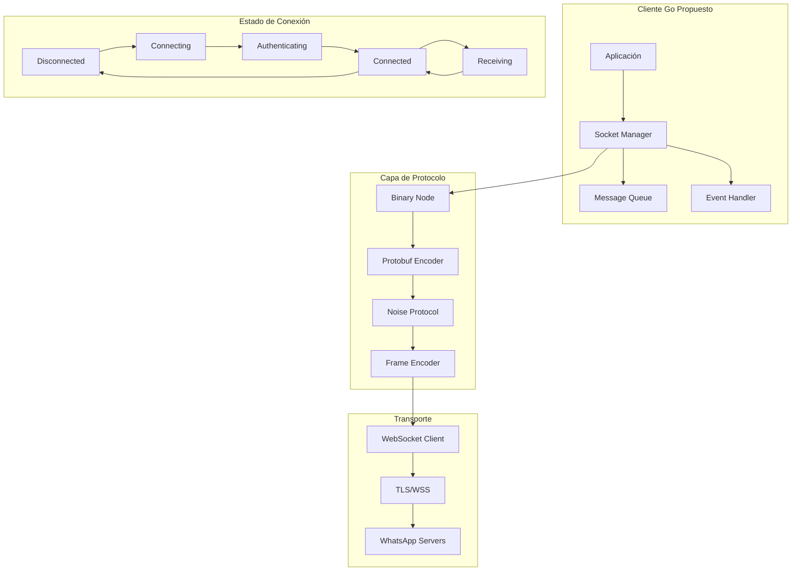
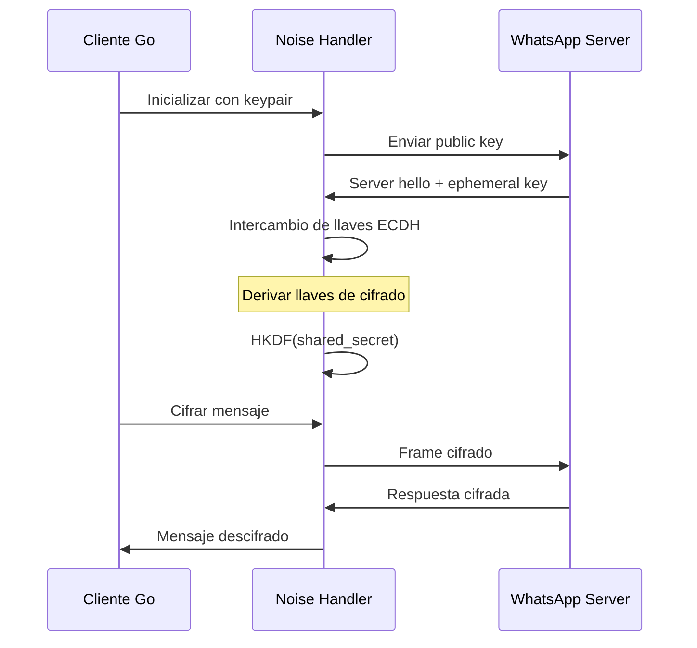

# Comunicación WebSocket - Análisis para Migración

## Arquitectura de Comunicación

Baileys implementa un stack de comunicación multicapa sobre WebSockets para conectarse con WhatsApp Web, utilizando protocolos propietarios para cifrado y framing.



## Componentes del Sistema

### 1. **WebSocket Client Abstraction**

**Node.js actual**:
```typescript
abstract class AbstractSocketClient extends EventEmitter {
    abstract get isOpen(): boolean
    abstract get isClosed(): boolean
    abstract get isClosing(): boolean
    abstract get isConnecting(): boolean
    
    abstract connect(): Promise<void>
    abstract close(): Promise<void>
    abstract send(data: Uint8Array | string): boolean
}
```

**Go propuesto**:
```go
type SocketState int

const (
    StateDisconnected SocketState = iota
    StateConnecting
    StateConnected
    StateClosing
)

type WebSocketClient interface {
    Connect(ctx context.Context) error
    Close() error
    Send(data []byte) error
    State() SocketState
    
    // Event channels
    Messages() <-chan []byte
    Errors() <-chan error
    StateChanges() <-chan SocketState
}

type GorillaSocektClient struct {
    conn    *websocket.Conn
    state   SocketState
    msgCh   chan []byte
    errCh   chan error
    stateCh chan SocketState
    mu      sync.RWMutex
}
```

### 2. **Noise Protocol Handler**

El protocolo Noise es crítico para la seguridad de WhatsApp:



**Implementación Go propuesta**:
```go
type NoiseHandler struct {
    keyPair     *KeyPair
    hash        []byte
    salt        []byte
    encKey      []byte
    decKey      []byte
    readCounter uint32
    writeCounter uint32
    isFinished  bool
    sentIntro   bool
    routingInfo []byte
}

func NewNoiseHandler(keyPair *KeyPair, header []byte, routingInfo []byte) *NoiseHandler {
    h := &NoiseHandler{
        keyPair:     keyPair,
        routingInfo: routingInfo,
    }
    
    // Initialize with NOISE_MODE hash
    data := []byte("Noise_XX_25519_AESGCM_SHA256")
    h.hash = sha256.Sum256(data)[:]
    h.salt = h.hash
    h.encKey = h.hash
    h.decKey = h.hash
    
    h.authenticate(header)
    h.authenticate(keyPair.Public)
    
    return h
}

func (n *NoiseHandler) Encrypt(plaintext []byte) ([]byte, error) {
    iv := n.generateIV(n.writeCounter)
    
    block, err := aes.NewCipher(n.encKey)
    if err != nil {
        return nil, err
    }
    
    gcm, err := cipher.NewGCM(block)
    if err != nil {
        return nil, err
    }
    
    ciphertext := gcm.Seal(nil, iv, plaintext, n.hash)
    n.writeCounter++
    n.authenticate(ciphertext)
    
    return ciphertext, nil
}
```

### 3. **Binary Node Protocol**

WhatsApp usa un protocolo binario personalizado sobre XML:

**Estructura del nodo**:
```go
type BinaryNode struct {
    Tag     string                 `json:"tag"`
    Attrs   map[string]string     `json:"attrs,omitempty"`
    Content []BinaryNodeContent   `json:"content,omitempty"`
}

type BinaryNodeContent interface {
    isBinaryNodeContent()
}

type BinaryNodeText string
type BinaryNodeList []BinaryNode

func (BinaryNodeText) isBinaryNodeContent() {}
func (BinaryNodeList) isBinaryNodeContent() {}

// Encoder/Decoder para el protocolo binario
type BinaryEncoder struct {
    strings map[string]int
    tags    map[string]int
}

func (be *BinaryEncoder) Encode(node *BinaryNode) ([]byte, error) {
    var buf bytes.Buffer
    err := be.writeNode(&buf, node)
    return buf.Bytes(), err
}
```

### 4. **Frame Protocol**

WhatsApp implementa su propio framing sobre WebSocket:

```go
type FrameHandler struct {
    noise       *NoiseHandler
    inBuffer    []byte
    routingInfo []byte
}

func (fh *FrameHandler) EncodeFrame(data []byte) ([]byte, error) {
    if fh.noise.isFinished {
        encrypted, err := fh.noise.Encrypt(data)
        if err != nil {
            return nil, err
        }
        data = encrypted
    }
    
    var header []byte
    if fh.routingInfo != nil {
        // WhatsApp routing protocol
        header = make([]byte, 7+len(fh.routingInfo))
        copy(header[0:2], "ED")
        header[2] = 0
        header[3] = 1
        header[4] = byte(len(fh.routingInfo) >> 16)
        binary.BigEndian.PutUint16(header[5:7], uint16(len(fh.routingInfo)))
        copy(header[7:], fh.routingInfo)
    }
    
    frameSize := len(header) + 3 + len(data)
    frame := make([]byte, frameSize)
    
    offset := 0
    if len(header) > 0 {
        copy(frame[offset:], header)
        offset += len(header)
    }
    
    // Frame length (3 bytes)
    frame[offset] = byte(len(data) >> 16)
    binary.BigEndian.PutUint16(frame[offset+1:offset+3], uint16(len(data)))
    offset += 3
    
    copy(frame[offset:], data)
    
    return frame, nil
}
```

### 5. **Message Queue & Event System**

**Go Channel-based approach**:
```go
type MessageQueue struct {
    incoming    chan *BinaryNode
    outgoing    chan *BinaryNode
    pending     map[string]chan *BinaryNode
    pendingMu   sync.RWMutex
    ctx         context.Context
    cancel      context.CancelFunc
}

func NewMessageQueue() *MessageQueue {
    ctx, cancel := context.WithCancel(context.Background())
    mq := &MessageQueue{
        incoming: make(chan *BinaryNode, 100),
        outgoing: make(chan *BinaryNode, 100),
        pending:  make(map[string]chan *BinaryNode),
        ctx:      ctx,
        cancel:   cancel,
    }
    
    go mq.processIncoming()
    go mq.processOutgoing()
    
    return mq
}

func (mq *MessageQueue) Query(node *BinaryNode, timeout time.Duration) (*BinaryNode, error) {
    if node.Attrs["id"] == "" {
        node.Attrs["id"] = generateMessageTag()
    }
    
    msgID := node.Attrs["id"]
    responseCh := make(chan *BinaryNode, 1)
    
    mq.pendingMu.Lock()
    mq.pending[msgID] = responseCh
    mq.pendingMu.Unlock()
    
    defer func() {
        mq.pendingMu.Lock()
        delete(mq.pending, msgID)
        mq.pendingMu.Unlock()
    }()
    
    select {
    case mq.outgoing <- node:
    case <-time.After(timeout):
        return nil, fmt.Errorf("timeout sending message")
    case <-mq.ctx.Done():
        return nil, mq.ctx.Err()
    }
    
    select {
    case response := <-responseCh:
        return response, nil
    case <-time.After(timeout):
        return nil, fmt.Errorf("timeout waiting for response")
    case <-mq.ctx.Done():
        return nil, mq.ctx.Err()
    }
}
```

## Análisis de Rendimiento

### **Node.js vs Go - Comparación esperada**

| Métrica | Node.js | Go Esperado | Mejora |
|---------|---------|-------------|--------|
| **Latencia WebSocket** | 2-5ms | 0.5-2ms | ~60% |
| **Throughput (msg/s)** | 1,000-5,000 | 10,000-50,000 | 10x |
| **Memoria por conexión** | 2-5MB | 200-500KB | 90% |
| **CPU por mensaje** | Alto (GC) | Bajo (compilado) | 5x |
| **Concurrencia** | Event Loop | Goroutines | Ilimitada |

### **Ventajas específicas de Go**

1. **Goroutines**: Una goroutine por conexión sin overhead significativo
2. **Channels**: Comunicación type-safe entre goroutines
3. **GC optimizado**: Menos pause times que Node.js
4. **Compilación nativa**: No interpretación en runtime
5. **Memory pooling**: Reutilización eficiente de buffers

## Migración Paso a Paso

### **Fase 1: Core WebSocket** ✅
```go
// Implementación básica con gorilla/websocket
type BasicWebSocketClient struct {
    conn *websocket.Conn
    url  string
}

func (c *BasicWebSocketClient) Connect() error {
    conn, _, err := websocket.DefaultDialer.Dial(c.url, nil)
    if err != nil {
        return err
    }
    c.conn = conn
    return nil
}
```

### **Fase 2: Noise Protocol** 🟡
```go
// Usar github.com/flynn/noise para base
// Implementar variante específica de WhatsApp
type WhatsAppNoise struct {
    handshake *noise.HandshakeState
    // ... campos específicos WA
}
```

### **Fase 3: Binary Protocol** ✅
```go
// Reimplemntación del protocolo binario de WA
// Basado en la especificación reversa del código JS
```

### **Fase 4: Integration Testing** 🔴
```go
// Tests exhaustivos de compatibilidad
// Verificar intercambio de mensajes con Baileys Node.js
```

## Librerías Go Recomendadas

| Funcionalidad | Librería | Razón |
|---------------|----------|-------|
| **WebSocket** | `github.com/gorilla/websocket` | Estable, bien documentada |
| **Noise Protocol** | `github.com/flynn/noise` | Implementación de referencia |
| **Protobuf** | `google.golang.org/protobuf` | Oficial de Google |
| **Crypto** | `crypto/*` estándar | Optimizado, auditado |
| **Logging** | `github.com/rs/zerolog` | Alto rendimiento |
| **Config** | `github.com/spf13/viper` | Flexible y completo |

## Desafíos Críticos

### 🔴 **Compatibilidad de Protocolo**
- Noise protocol debe ser bit-perfect compatible
- Binary encoding exacto
- Frame protocol timing-sensitive

### 🟡 **Estado de Conexión**
- Manejo de reconexión automática
- Persist session state durante desconexiones
- Heartbeat y keep-alive apropiado

### 🟢 **Performance**
- Aprovechar concurrencia de Go
- Pool de buffers para reducir GC
- Métricas integradas

## Recomendación de Arquitectura

```go
type WASocket struct {
    // Core components
    wsClient    WebSocketClient
    noise       *NoiseHandler
    frames      *FrameHandler
    messages    *MessageQueue
    auth        *AuthManager
    
    // State management
    state       SocketState
    stateMu     sync.RWMutex
    
    // Event system
    events      chan Event
    subscribers map[EventType][]chan Event
    
    // Lifecycle
    ctx         context.Context
    cancel      context.CancelFunc
    wg          sync.WaitGroup
}

func NewWASocket(config *Config) *WASocket {
    ctx, cancel := context.WithCancel(context.Background())
    
    return &WASocket{
        wsClient:    NewGorillSocketClient(config.URL),
        noise:       NewNoiseHandler(config.KeyPair, config.NoiseHeader, config.RoutingInfo),
        frames:      NewFrameHandler(),
        messages:    NewMessageQueue(),
        auth:        NewAuthManager(config.AuthConfig),
        state:       StateDisconnected,
        events:      make(chan Event, 100),
        subscribers: make(map[EventType][]chan Event),
        ctx:         ctx,
        cancel:      cancel,
    }
}
```

Esta arquitectura proporciona:
- **Separación clara** de responsabilidades
- **Concurrencia segura** con Go patterns
- **Escalabilidad** con channels y goroutines
- **Observabilidad** con eventos y métricas
- **Mantenibilidad** con interfaces bien definidas