# Signal Protocol - Análisis Crítico para Migración

## Arquitectura Signal Protocol en Baileys

Baileys utiliza el Signal Protocol (Double Ratchet Algorithm) para cifrado end-to-end de mensajes individuales y grupales. Este es el **componente más crítico** para la migración, ya que requiere compatibilidad bit-perfect.


## Implementación Actual (Node.js)

### 1. **Dependencia libsignal**

**package.json**:
```json
{
  "libsignal": "git+https://github.com/whiskeysockets/libsignal-node"
}
```

Esta es una **fork customizada** de la implementación oficial, lo que añade complejidad:

```mermaid
flowchart LR
    subgraph "Signal Foundation"
        A[libsignal Rust] --> B[libsignal-c]
    end
    
    subgraph "WhatsApp Fork"
        B --> C[WhiskeySocket/libsignal-node]
        C --> D[Baileys Integration]
    end
    
    subgraph "Migración Go"
        E[Go Implementation] --> F[CGO Wrapper]
        F --> G[libsignal-c]
        
        H[Pure Go] --> I[Reimplementación]
        I --> J[Double Ratchet]
    end
    
    B -.-> F
    C -.-> I
```



### 2. **SignalRepository Interface**

**Core abstraction** en Baileys:

```typescript
interface SignalRepository {
    // Mensajes individuales
    decryptMessage(params: {
        jid: string
        type: 'pkmsg' | 'msg'
        ciphertext: Buffer
    }): Promise<Buffer>
    
    encryptMessage(params: {
        jid: string
        data: Buffer
    }): Promise<{
        type: 'pkmsg' | 'msg'
        ciphertext: Buffer
    }>
    
    // Mensajes grupales
    decryptGroupMessage(params: {
        group: string
        authorJid: string
        msg: Buffer
    }): Promise<Buffer>
    
    encryptGroupMessage(params: {
        group: string
        meId: string
        data: Buffer
    }): Promise<{
        ciphertext: Buffer
        senderKeyDistributionMessage: Buffer
    }>
    
    // Gestión de sesiones
    injectE2ESession(params: {
        jid: string
        session: any
    }): Promise<void>
    
    processSenderKeyDistributionMessage(params: {
        item: any
        authorJid: string
    }): Promise<void>
    
    jidToSignalProtocolAddress(jid: string): string
}
```

### 3. **Signal Storage Adapter**

**Mapping crítico** entre Baileys y libsignal:

```typescript
function signalStorage({ creds, keys }: SignalAuthState): SenderKeyStore {
    return {
        // Sesiones individuales
        loadSession: async (id: string) => {
            const { [id]: sess } = await keys.get('session', [id])
            if (sess) {
                return libsignal.SessionRecord.deserialize(sess)
            }
        },
        
        storeSession: async (id: string, session: any) => {
            await keys.set({ session: { [id]: session.serialize() } })
        },
        
        // PreKeys
        loadPreKey: async (id: number | string) => {
            const keyId = id.toString()
            const { [keyId]: key } = await keys.get('pre-key', [keyId])
            if (key) {
                return {
                    privKey: Buffer.from(key.private),
                    pubKey: Buffer.from(key.public)
                }
            }
        },
        
        // Sender Keys (grupos)
        loadSenderKey: async (senderKeyName: SenderKeyName) => {
            const keyId = senderKeyName.toString()
            const { [keyId]: key } = await keys.get('sender-key', [keyId])
            if (key) {
                return SenderKeyRecord.deserialize(key)
            }
            return new SenderKeyRecord()
        },
        
        storeSenderKey: async (senderKeyName: SenderKeyName, key: SenderKeyRecord) => {
            const keyId = senderKeyName.toString()
            const serialized = JSON.stringify(key.serialize())
            await keys.set({ 'sender-key': { [keyId]: Buffer.from(serialized, 'utf-8') } })
        },
        
        // Identity
        getOurRegistrationId: () => creds.registrationId,
        getOurIdentity: () => ({
            privKey: Buffer.from(creds.signedIdentityKey.private),
            pubKey: generateSignalPubKey(creds.signedIdentityKey.public)
        })
    }
}
```

### 4. **Curve Operations**

**Crypto primitivas** basadas en libsignal:

```typescript
export const Curve = {
    generateKeyPair: (): KeyPair => {
        const { pubKey, privKey } = libsignal.curve.generateKeyPair()
        return {
            private: Buffer.from(privKey),
            public: Buffer.from(pubKey.slice(1)) // remove version byte
        }
    },
    
    sharedKey: (privateKey: Uint8Array, publicKey: Uint8Array) => {
        const shared = libsignal.curve.calculateAgreement(
            generateSignalPubKey(publicKey), 
            privateKey
        )
        return Buffer.from(shared)
    },
    
    sign: (privateKey: Uint8Array, buf: Uint8Array) => 
        libsignal.curve.calculateSignature(privateKey, buf),
    
    verify: (pubKey: Uint8Array, message: Uint8Array, signature: Uint8Array) => {
        try {
            libsignal.curve.verifySignature(
                generateSignalPubKey(pubKey), 
                message, 
                signature
            )
            return true
        } catch (error) {
            return false
        }
    }
}
```

## Migración a Go - Opciones

### **Opción 1: CGO + libsignal-c** ⭐ **RECOMENDADA**

```go
package signal

/*
#cgo pkg-config: libsignal-ffi
#include <signal_ffi.h>
#include <stdlib.h>
*/
import "C"
import (
    "fmt"
    "unsafe"
)

// SignalContext wraps libsignal-c context
type SignalContext struct {
    ctx *C.SignalContext
}

func NewSignalContext() (*SignalContext, error) {
    ctx := C.signal_context_create()
    if ctx == nil {
        return nil, fmt.Errorf("failed to create signal context")
    }
    
    return &SignalContext{ctx: ctx}, nil
}

func (sc *SignalContext) Close() {
    if sc.ctx != nil {
        C.signal_context_destroy(sc.ctx)
        sc.ctx = nil
    }
}

// Generate Curve25519 key pair
func (sc *SignalContext) GenerateKeyPair() (*KeyPair, error) {
    var publicKey *C.uint8_t
    var privateKey *C.uint8_t
    
    result := C.curve_generate_key_pair(
        sc.ctx,
        &publicKey,
        &privateKey,
    )
    
    if result != C.SIGNAL_SUCCESS {
        return nil, fmt.Errorf("failed to generate key pair: %d", result)
    }
    
    defer C.signal_buffer_free((*C.SignalBuffer)(unsafe.Pointer(publicKey)))
    defer C.signal_buffer_free((*C.SignalBuffer)(unsafe.Pointer(privateKey)))
    
    return &KeyPair{
        Public:  C.GoBytes(unsafe.Pointer(publicKey), 32),
        Private: C.GoBytes(unsafe.Pointer(privateKey), 32),
    }, nil
}

// Session management
type SessionStore struct {
    sessions map[string][]byte
    mu       sync.RWMutex
}

func (ss *SessionStore) LoadSession(address *ProtocolAddress) (*SessionRecord, error) {
    ss.mu.RLock()
    defer ss.mu.RUnlock()
    
    key := address.String()
    if data, exists := ss.sessions[key]; exists {
        return DeserializeSessionRecord(data)
    }
    
    return NewSessionRecord(), nil
}

func (ss *SessionStore) StoreSession(address *ProtocolAddress, record *SessionRecord) error {
    ss.mu.Lock()
    defer ss.mu.Unlock()
    
    data, err := record.Serialize()
    if err != nil {
        return err
    }
    
    ss.sessions[address.String()] = data
    return nil
}

// Session Cipher for E2E encryption
type SessionCipher struct {
    store   *SessionStore
    address *ProtocolAddress
    ctx     *SignalContext
}

func NewSessionCipher(store *SessionStore, address *ProtocolAddress) *SessionCipher {
    return &SessionCipher{
        store:   store,
        address: address,
        ctx:     globalSignalContext, // Singleton
    }
}

func (sc *SessionCipher) Encrypt(plaintext []byte) (*CipherMessage, error) {
    session, err := sc.store.LoadSession(sc.address)
    if err != nil {
        return nil, err
    }
    
    // Use libsignal-c functions via CGO
    cPlaintext := C.CBytes(plaintext)
    defer C.free(cPlaintext)
    
    var ciphertext *C.uint8_t
    var length C.size_t
    var messageType C.int
    
    result := C.session_cipher_encrypt(
        sc.ctx.ctx,
        (*C.uint8_t)(cPlaintext),
        C.size_t(len(plaintext)),
        &ciphertext,
        &length,
        &messageType,
    )
    
    if result != C.SIGNAL_SUCCESS {
        return nil, fmt.Errorf("encryption failed: %d", result)
    }
    
    defer C.signal_buffer_free((*C.SignalBuffer)(unsafe.Pointer(ciphertext)))
    
    msgType := "msg"
    if messageType == C.CIPHERTEXT_PREKEY_TYPE {
        msgType = "pkmsg"
    }
    
    return &CipherMessage{
        Type:       msgType,
        Ciphertext: C.GoBytes(unsafe.Pointer(ciphertext), C.int(length)),
    }, nil
}
```

### **Opción 2: Pure Go Implementation** 🟡 **COMPLEJA**

```go
package signal

import (
    "crypto/rand"
    "crypto/sha256"
    "golang.org/x/crypto/curve25519"
    "golang.org/x/crypto/hkdf"
)

// Pure Go Curve25519 operations
type Curve25519 struct{}

func (c *Curve25519) GenerateKeyPair() (*KeyPair, error) {
    private := make([]byte, 32)
    if _, err := rand.Read(private); err != nil {
        return nil, err
    }
    
    public, err := curve25519.X25519(private, curve25519.Basepoint)
    if err != nil {
        return nil, err
    }
    
    return &KeyPair{
        Private: private,
        Public:  public,
    }, nil
}

func (c *Curve25519) CalculateAgreement(privateKey, publicKey []byte) ([]byte, error) {
    return curve25519.X25519(privateKey, publicKey)
}

// Double Ratchet implementation
type DoubleRatchet struct {
    rootKey    []byte
    chainKey   []byte
    headerKey  []byte
    nextHeader []byte
}

func (dr *DoubleRatchet) RatchetEncrypt(plaintext []byte, header []byte) ([]byte, error) {
    // Implement Signal's Double Ratchet algorithm
    // This is highly complex and requires exact compatibility
    
    // 1. Derive message key from chain key
    messageKey := dr.deriveMessageKey()
    
    // 2. Advance chain key
    dr.chainKey = dr.deriveNextChainKey()
    
    // 3. Encrypt with AES-256-CBC + HMAC
    ciphertext := dr.encryptWithMessageKey(plaintext, messageKey)
    
    return ciphertext, nil
}

func (dr *DoubleRatchet) deriveMessageKey() []byte {
    // HKDF derivation based on Signal spec
    hkdfExtract := hkdf.Extract(sha256.New, dr.chainKey, []byte("WhisperMessageKeys"))
    reader := hkdf.Expand(sha256.New, hkdfExtract, []byte("encryption"))
    
    key := make([]byte, 80) // 32 for cipher + 32 for mac + 16 for iv
    reader.Read(key)
    
    return key
}

// Group cipher implementation
type GroupCipher struct {
    senderKeyStore SenderKeyStore
    senderKeyName  *SenderKeyName
}

func (gc *GroupCipher) Encrypt(plaintext []byte) ([]byte, error) {
    record, err := gc.senderKeyStore.LoadSenderKey(gc.senderKeyName)
    if err != nil {
        return nil, err
    }
    
    state := record.GetSenderKeyState()
    if state == nil {
        return nil, fmt.Errorf("no sender key state")
    }
    
    // Implement Sender Key encryption
    chainKey := state.GetSenderChainKey()
    messageKey := chainKey.GetSenderMessageKey()
    
    // Encrypt with derived key
    ciphertext := aesEncryptCBC(plaintext, messageKey.GetCipherKey(), messageKey.GetIv())
    
    // Create SenderKeyMessage
    senderKeyMessage := &SenderKeyMessage{
        KeyId:      state.GetKeyId(),
        Iteration:  messageKey.GetIteration(),
        Ciphertext: ciphertext,
    }
    
    // Sign the message
    signature := ed25519.Sign(state.GetSigningKeyPrivate(), senderKeyMessage.SerializeForSignature())
    senderKeyMessage.Signature = signature
    
    return senderKeyMessage.Serialize(), nil
}
```

## Implementación Go Recomendada

### **Arquitectura Propuesta**

```go
// SignalRepository - Interface principal
type SignalRepository interface {
    // Individual messages
    EncryptMessage(ctx context.Context, req *EncryptMessageRequest) (*EncryptMessageResponse, error)
    DecryptMessage(ctx context.Context, req *DecryptMessageRequest) (*DecryptMessageResponse, error)
    
    // Group messages
    EncryptGroupMessage(ctx context.Context, req *EncryptGroupMessageRequest) (*EncryptGroupMessageResponse, error)
    DecryptGroupMessage(ctx context.Context, req *DecryptGroupMessageRequest) (*DecryptGroupMessageResponse, error)
    
    // Session management
    InjectE2ESession(ctx context.Context, jid string, session *PreKeyBundle) error
    ProcessSenderKeyDistribution(ctx context.Context, req *SenderKeyDistributionRequest) error
    
    // Utilities
    JidToProtocolAddress(jid string) string
}

// Implementación con CGO
type CGOSignalRepository struct {
    signalCtx   *SignalContext
    sessionStore SessionStore
    preKeyStore  PreKeyStore
    senderKeyStore SenderKeyStore
    identityStore IdentityStore
    
    // Thread safety
    mu sync.RWMutex
}

func NewCGOSignalRepository(auth *AuthState) (*CGOSignalRepository, error) {
    ctx, err := NewSignalContext()
    if err != nil {
        return nil, fmt.Errorf("failed to create signal context: %w", err)
    }
    
    return &CGOSignalRepository{
        signalCtx:      ctx,
        sessionStore:   NewFileSessionStore(auth),
        preKeyStore:    NewFilePreKeyStore(auth),
        senderKeyStore: NewFileSenderKeyStore(auth),
        identityStore:  NewFileIdentityStore(auth),
    }, nil
}

func (r *CGOSignalRepository) EncryptMessage(ctx context.Context, req *EncryptMessageRequest) (*EncryptMessageResponse, error) {
    r.mu.RLock()
    defer r.mu.RUnlock()
    
    address, err := ParseProtocolAddress(req.Jid)
    if err != nil {
        return nil, err
    }
    
    cipher := NewSessionCipher(r.sessionStore, address)
    result, err := cipher.Encrypt(req.Data)
    if err != nil {
        return nil, fmt.Errorf("encryption failed: %w", err)
    }
    
    return &EncryptMessageResponse{
        Type:       result.Type,
        Ciphertext: result.Ciphertext,
    }, nil
}
```

### **Store Implementations**

```go
// File-based stores compatible with Baileys format
type FileSessionStore struct {
    authState *AuthState
    mu        sync.RWMutex
}

func (fs *FileSessionStore) LoadSession(address *ProtocolAddress) (*SessionRecord, error) {
    fs.mu.RLock()
    defer fs.mu.RUnlock()
    
    key := address.String()
    sessions, err := fs.authState.Keys.Get("session", []string{key})
    if err != nil {
        return nil, err
    }
    
    if data, exists := sessions[key]; exists {
        return DeserializeSessionRecord(data), nil
    }
    
    return NewSessionRecord(), nil
}

func (fs *FileSessionStore) StoreSession(address *ProtocolAddress, record *SessionRecord) error {
    fs.mu.Lock()
    defer fs.mu.Unlock()
    
    key := address.String()
    data, err := record.Serialize()
    if err != nil {
        return err
    }
    
    return fs.authState.Keys.Set(map[string]map[string]interface{}{
        "session": {key: data},
    })
}

// Prekey store
type FilePreKeyStore struct {
    authState *AuthState
    mu        sync.RWMutex
}

func (fps *FilePreKeyStore) LoadPreKey(preKeyId uint32) (*PreKeyRecord, error) {
    fps.mu.RLock()
    defer fps.mu.RUnlock()
    
    key := fmt.Sprintf("%d", preKeyId)
    preKeys, err := fps.authState.Keys.Get("pre-key", []string{key})
    if err != nil {
        return nil, err
    }
    
    if data, exists := preKeys[key]; exists {
        return DeserializePreKeyRecord(data), nil
    }
    
    return nil, fmt.Errorf("prekey not found: %d", preKeyId)
}
```

### **Performance Optimizations**

```go
// Connection pool for CGO calls
type SignalContextPool struct {
    pool chan *SignalContext
    size int
}

func NewSignalContextPool(size int) (*SignalContextPool, error) {
    pool := make(chan *SignalContext, size)
    
    for i := 0; i < size; i++ {
        ctx, err := NewSignalContext()
        if err != nil {
            return nil, err
        }
        pool <- ctx
    }
    
    return &SignalContextPool{
        pool: pool,
        size: size,
    }, nil
}

func (p *SignalContextPool) Get() *SignalContext {
    return <-p.pool
}

func (p *SignalContextPool) Put(ctx *SignalContext) {
    select {
    case p.pool <- ctx:
    default:
        // Pool is full, discard context
        ctx.Close()
    }
}

// Memory pooling for buffers
var bufferPool = sync.Pool{
    New: func() interface{} {
        return make([]byte, 0, 4096)
    },
}

func getBuf() []byte {
    return bufferPool.Get().([]byte)[:0]
}

func putBuf(buf []byte) {
    if cap(buf) < 64*1024 { // Don't pool huge buffers
        bufferPool.Put(buf)
    }
}
```

## Desafíos Críticos

### 🔴 **Compatibilidad Cryptográfica**

1. **Bit-perfect compatibility**: Los algoritmos deben ser idénticos
2. **Key derivation**: HKDF, KDF chains deben coincidir exactamente  
3. **Message format**: Serialization debe ser compatible
4. **Signature format**: Ed25519/ECDSA compatibility

### 🟡 **Migración de Datos**

```go
// Migrator para convertir stores de Node.js a Go
type StoreMigrator struct {
    nodePath string
    goStore  *AuthState
}

func (sm *StoreMigrator) MigrateNodeToGo() error {
    // 1. Load Node.js auth state
    nodeAuth, err := sm.loadNodeAuthState()
    if err != nil {
        return err
    }
    
    // 2. Convert sessions
    if err := sm.migrateSessions(nodeAuth); err != nil {
        return err
    }
    
    // 3. Convert prekeys
    if err := sm.migratePreKeys(nodeAuth); err != nil {
        return err
    }
    
    // 4. Convert sender keys
    if err := sm.migrateSenderKeys(nodeAuth); err != nil {
        return err
    }
    
    return nil
}
```

### 🟢 **Testing Strategy**

```go
// Cross-compatibility tests
func TestNodeGoCompatibility(t *testing.T) {
    // 1. Setup Node.js Baileys instance
    nodeSocket := setupNodeBaileys()
    
    // 2. Setup Go implementation
    goSocket := setupGoBaileys()
    
    // 3. Test message exchange
    message := "Hello from Go!"
    
    // Encrypt with Go, decrypt with Node
    encrypted, err := goSocket.Encrypt(message)
    require.NoError(t, err)
    
    decrypted, err := nodeSocket.Decrypt(encrypted)
    require.NoError(t, err)
    require.Equal(t, message, decrypted)
    
    // Reverse test
    nodeEncrypted, err := nodeSocket.Encrypt("Hello from Node!")
    require.NoError(t, err)
    
    goDecrypted, err := goSocket.Decrypt(nodeEncrypted)
    require.NoError(t, err)
    require.Equal(t, "Hello from Node!", goDecrypted)
}
```

## Recomendación Final

### ✅ **Path Recomendado: CGO + libsignal-c**

**Ventajas**:
- ✅ Compatibilidad garantizada con Signal Foundation
- ✅ Mantenimiento upstream automático
- ✅ Performance nativa de Rust/C
- ✅ Reducción de bugs crypto
- ✅ Tiempo de desarrollo menor

**Desventajas**:
- ❌ Dependencia CGO (cross-compilation más compleja)
- ❌ Tamaño binario mayor
- ❌ Debugging más complejo

### 📋 **Plan de Implementación**

1. **Semana 1-2**: Setup CGO + libsignal-c bindings
2. **Semana 3-4**: Implementar stores file-based compatibles
3. **Semana 5-6**: Testing exhaustivo compatibilidad Node.js ↔ Go
4. **Semana 7**: Performance optimization + pooling
5. **Semana 8**: Documentación y migration tools

### 🔧 **Librerías Go Necesarias**

```go
// Dependencies para CGO approach
require (
    github.com/signalapp/libsignal-go v0.1.0  // Si existe bindings oficiales
    // O crear nuestros propios bindings CGO
)

// Dependencies para Pure Go approach (backup)
require (
    golang.org/x/crypto v0.15.0
    github.com/aead/chacha20poly1305 v0.0.0-20201124145622-1a5aba2a8b29
)
```

La migración del Signal Protocol es **factible pero requiere extremo cuidado** en la compatibilidad cryptográfica. El enfoque CGO es la opción más segura para mantener compatibilidad total con la implementación actual de Baileys.