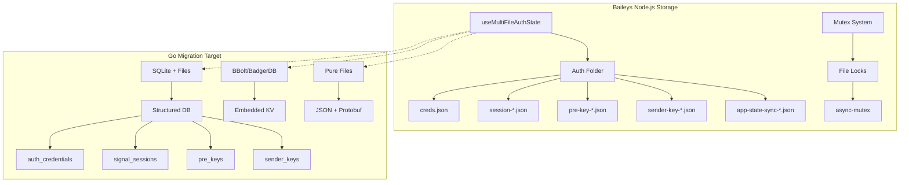

# Almacenamiento de Datos - Análisis para Migración

## Arquitectura de Almacenamiento Actual

Baileys utiliza un sistema de **almacenamiento basado en archivos** con estructura modular para persistir credenciales, llaves criptográficas y estados de sesión. El diseño está optimizado para bots y aplicaciones simples, pero presenta limitaciones de escalabilidad.



## Implementación Actual (Node.js)

### 1. **MultiFile Auth State**

**Estructura principal** de almacenamiento:

```typescript
interface AuthenticationState {
    creds: AuthenticationCreds     // Credenciales principales
    keys: SignalKeyStore          // Store de llaves Signal
}

interface SignalDataTypeMap {
    'pre-key': KeyPair                    // Llaves pre-generadas
    'session': Uint8Array                 // Sesiones E2E cifradas
    'sender-key': Uint8Array              // Llaves para grupos
    'sender-key-memory': { [jid: string]: boolean }
    'app-state-sync-key': proto.Message.IAppStateSyncKeyData
    'app-state-sync-version': LTHashState
}
```

### 2. **File Structure Layout**

```bash
auth_folder/
├── creds.json                    # Credenciales principales
├── session-34567890123456.json   # Sesión individual  
├── session-98765432109876.json   # Otra sesión
├── pre-key-1.json                # PreKey ID 1
├── pre-key-2.json                # PreKey ID 2
├── sender-key-120363XYZ@g.us__34567890123456-0.json  # Grupo
├── app-state-sync-key-AAAA.json  # App state sync
└── app-state-sync-version-contacts.json
```

### 3. **Concurrency Control**

**Mutex per-file** para evitar race conditions:

```typescript
const fileLocks = new Map<string, Mutex>()

const getFileLock = (path: string): Mutex => {
    let mutex = fileLocks.get(path)
    if (!mutex) {
        mutex = new Mutex()
        fileLocks.set(path, mutex)
    }
    return mutex
}

const writeData = async (data: any, file: string) => {
    const filePath = join(folder, fixFileName(file)!)
    const mutex = getFileLock(filePath)

    return mutex.acquire().then(async release => {
        try {
            await writeFile(filePath, JSON.stringify(data, BufferJSON.replacer))
        } finally {
            release()
        }
    })
}
```

### 4. **Key Store Interface**

```typescript
interface SignalKeyStore {
    get<T extends keyof SignalDataTypeMap>(
        type: T, 
        ids: string[]
    ): Promise<{ [id: string]: SignalDataTypeMap[T] }>
    
    set(data: SignalDataSet): Promise<void>
    clear?(): Promise<void>
}

// Implementación file-based
const keys: SignalKeyStore = {
    get: async (type, ids) => {
        const data: { [_: string]: SignalDataTypeMap[typeof type] } = {}
        await Promise.all(
            ids.map(async id => {
                let value = await readData(`${type}-${id}.json`)
                if (type === 'app-state-sync-key' && value) {
                    value = proto.Message.AppStateSyncKeyData.fromObject(value)
                }
                data[id] = value
            })
        )
        return data
    },
    
    set: async data => {
        const tasks: Promise<void>[] = []
        for (const category in data) {
            for (const id in data[category as keyof SignalDataTypeMap]) {
                const value = data[category as keyof SignalDataTypeMap]![id]
                const file = `${category}-${id}.json`
                tasks.push(value ? writeData(value, file) : removeData(file))
            }
        }
        await Promise.all(tasks)
    }
}
```

### 5. **Credential Management**

**AuthenticationCreds structure**:

```typescript
interface AuthenticationCreds extends SignalCreds {
    // Noise Protocol keys
    readonly noiseKey: KeyPair
    readonly pairingEphemeralKeyPair: KeyPair
    
    // WhatsApp specific
    advSecretKey: string
    me?: Contact
    account?: proto.IADVSignedDeviceIdentity
    
    // Key management
    firstUnuploadedPreKeyId: number
    nextPreKeyId: number
    
    // Sync state
    lastAccountSyncTimestamp?: number
    processedHistoryMessages: MinimalMessage[]
    accountSyncCounter: number
    
    // Session state
    registered: boolean
    pairingCode: string | undefined
    routingInfo: Buffer | undefined
}
```

## Migración a Go - Opciones de Almacenamiento

### **Opción 1: SQLite + Files Híbrido** ⭐ **RECOMENDADA**

```go
package storage

import (
    "database/sql"
    "encoding/json"
    "fmt"
    "path/filepath"
    "sync"
    
    _ "github.com/mattn/go-sqlite3"
    "github.com/golang/protobuf/proto"
)

// Database schema
const schema = `
CREATE TABLE IF NOT EXISTS auth_credentials (
    id INTEGER PRIMARY KEY,
    user_id TEXT UNIQUE NOT NULL,
    noise_private_key BLOB NOT NULL,
    noise_public_key BLOB NOT NULL,
    pairing_ephemeral_private BLOB NOT NULL,
    pairing_ephemeral_public BLOB NOT NULL,
    signed_identity_private BLOB NOT NULL,
    signed_identity_public BLOB NOT NULL,
    signed_prekey_id INTEGER NOT NULL,
    signed_prekey_private BLOB NOT NULL,
    signed_prekey_public BLOB NOT NULL,
    signed_prekey_signature BLOB NOT NULL,
    registration_id INTEGER NOT NULL,
    adv_secret_key TEXT NOT NULL,
    next_prekey_id INTEGER DEFAULT 1,
    first_unuploaded_prekey_id INTEGER DEFAULT 1,
    last_account_sync_timestamp INTEGER,
    account_sync_counter INTEGER DEFAULT 0,
    registered BOOLEAN DEFAULT FALSE,
    pairing_code TEXT,
    routing_info BLOB,
    created_at DATETIME DEFAULT CURRENT_TIMESTAMP,
    updated_at DATETIME DEFAULT CURRENT_TIMESTAMP
);

CREATE TABLE IF NOT EXISTS signal_sessions (
    id INTEGER PRIMARY KEY,
    address TEXT NOT NULL,
    device_id INTEGER NOT NULL,
    session_data BLOB NOT NULL,
    created_at DATETIME DEFAULT CURRENT_TIMESTAMP,
    updated_at DATETIME DEFAULT CURRENT_TIMESTAMP,
    UNIQUE(address, device_id)
);

CREATE TABLE IF NOT EXISTS pre_keys (
    id INTEGER PRIMARY KEY,
    key_id INTEGER UNIQUE NOT NULL,
    private_key BLOB NOT NULL,
    public_key BLOB NOT NULL,
    uploaded BOOLEAN DEFAULT FALSE,
    created_at DATETIME DEFAULT CURRENT_TIMESTAMP
);

CREATE TABLE IF NOT EXISTS sender_keys (
    id INTEGER PRIMARY KEY,
    group_id TEXT NOT NULL,
    sender_address TEXT NOT NULL,
    device_id INTEGER NOT NULL,
    key_data BLOB NOT NULL,
    created_at DATETIME DEFAULT CURRENT_TIMESTAMP,
    updated_at DATETIME DEFAULT CURRENT_TIMESTAMP,
    UNIQUE(group_id, sender_address, device_id)
);

CREATE TABLE IF NOT EXISTS app_state_sync_keys (
    id INTEGER PRIMARY KEY,
    key_id TEXT UNIQUE NOT NULL,
    key_data BLOB NOT NULL,
    fingerprint BLOB,
    timestamp BIGINT,
    created_at DATETIME DEFAULT CURRENT_TIMESTAMP
);

CREATE TABLE IF NOT EXISTS app_state_sync_versions (
    id INTEGER PRIMARY KEY,
    name TEXT UNIQUE NOT NULL,
    version INTEGER NOT NULL,
    hash BLOB NOT NULL,
    index_value_map TEXT, -- JSON serialized map
    updated_at DATETIME DEFAULT CURRENT_TIMESTAMP
);

-- Indexes for performance
CREATE INDEX IF NOT EXISTS idx_sessions_address ON signal_sessions(address);
CREATE INDEX IF NOT EXISTS idx_prekeys_uploaded ON pre_keys(uploaded);
CREATE INDEX IF NOT EXISTS idx_sender_keys_group ON sender_keys(group_id);
CREATE INDEX IF NOT EXISTS idx_sync_keys_keyid ON app_state_sync_keys(key_id);
`

// AuthStore implementation
type SQLiteAuthStore struct {
    db       *sql.DB
    authDir  string
    mu       sync.RWMutex
    
    // File locks (similar to Node.js implementation)
    fileLocks map[string]*sync.Mutex
    locksMu   sync.Mutex
}

func NewSQLiteAuthStore(dbPath, authDir string) (*SQLiteAuthStore, error) {
    db, err := sql.Open("sqlite3", dbPath+"?_foreign_keys=on&_journal_mode=WAL")
    if err != nil {
        return nil, fmt.Errorf("failed to open database: %w", err)
    }
    
    if _, err := db.Exec(schema); err != nil {
        return nil, fmt.Errorf("failed to create schema: %w", err)
    }
    
    return &SQLiteAuthStore{
        db:        db,
        authDir:   authDir,
        fileLocks: make(map[string]*sync.Mutex),
    }, nil
}

// Implement SignalKeyStore interface
func (s *SQLiteAuthStore) Get(keyType string, ids []string) (map[string]interface{}, error) {
    s.mu.RLock()
    defer s.mu.RUnlock()
    
    result := make(map[string]interface{})
    
    switch keyType {
    case "session":
        return s.getSessions(ids)
    case "pre-key":
        return s.getPreKeys(ids)
    case "sender-key":
        return s.getSenderKeys(ids)
    case "app-state-sync-key":
        return s.getAppStateSyncKeys(ids)
    case "app-state-sync-version":
        return s.getAppStateSyncVersions(ids)
    default:
        return nil, fmt.Errorf("unknown key type: %s", keyType)
    }
}

func (s *SQLiteAuthStore) getSessions(ids []string) (map[string]interface{}, error) {
    result := make(map[string]interface{})
    
    for _, id := range ids {
        var sessionData []byte
        err := s.db.QueryRow(
            "SELECT session_data FROM signal_sessions WHERE address = ? AND device_id = ?",
            parseAddressFromID(id),
        ).Scan(&sessionData)
        
        if err == sql.ErrNoRows {
            continue // Session doesn't exist
        } else if err != nil {
            return nil, err
        }
        
        result[id] = sessionData
    }
    
    return result, nil
}

func (s *SQLiteAuthStore) getPreKeys(ids []string) (map[string]interface{}, error) {
    result := make(map[string]interface{})
    
    for _, id := range ids {
        var privateKey, publicKey []byte
        err := s.db.QueryRow(
            "SELECT private_key, public_key FROM pre_keys WHERE key_id = ?",
            id,
        ).Scan(&privateKey, &publicKey)
        
        if err == sql.ErrNoRows {
            continue
        } else if err != nil {
            return nil, err
        }
        
        result[id] = map[string][]byte{
            "private": privateKey,
            "public":  publicKey,
        }
    }
    
    return result, nil
}

func (s *SQLiteAuthStore) Set(data map[string]map[string]interface{}) error {
    s.mu.Lock()
    defer s.mu.Unlock()
    
    tx, err := s.db.Begin()
    if err != nil {
        return err
    }
    defer tx.Rollback()
    
    for keyType, items := range data {
        switch keyType {
        case "session":
            if err := s.setSessions(tx, items); err != nil {
                return err
            }
        case "pre-key":
            if err := s.setPreKeys(tx, items); err != nil {
                return err
            }
        case "sender-key":
            if err := s.setSenderKeys(tx, items); err != nil {
                return err
            }
        case "app-state-sync-key":
            if err := s.setAppStateSyncKeys(tx, items); err != nil {
                return err
            }
        case "app-state-sync-version":
            if err := s.setAppStateSyncVersions(tx, items); err != nil {
                return err
            }
        }
    }
    
    return tx.Commit()
}

func (s *SQLiteAuthStore) setSessions(tx *sql.Tx, items map[string]interface{}) error {
    stmt, err := tx.Prepare(`
        INSERT OR REPLACE INTO signal_sessions 
        (address, device_id, session_data, updated_at) 
        VALUES (?, ?, ?, CURRENT_TIMESTAMP)
    `)
    if err != nil {
        return err
    }
    defer stmt.Close()
    
    for id, value := range items {
        if value == nil {
            // Delete session
            _, err := tx.Exec("DELETE FROM signal_sessions WHERE address = ? AND device_id = ?",
                parseAddressFromID(id))
            if err != nil {
                return err
            }
            continue
        }
        
        sessionData, ok := value.([]byte)
        if !ok {
            return fmt.Errorf("invalid session data type for %s", id)
        }
        
        address, deviceID := parseAddressFromID(id)
        _, err := stmt.Exec(address, deviceID, sessionData)
        if err != nil {
            return err
        }
    }
    
    return nil
}

// Credential management
func (s *SQLiteAuthStore) SaveCredentials(creds *AuthenticationCreds) error {
    s.mu.Lock()
    defer s.mu.Unlock()
    
    query := `
    INSERT OR REPLACE INTO auth_credentials (
        user_id, noise_private_key, noise_public_key,
        pairing_ephemeral_private, pairing_ephemeral_public,
        signed_identity_private, signed_identity_public,
        signed_prekey_id, signed_prekey_private, signed_prekey_public, signed_prekey_signature,
        registration_id, adv_secret_key, next_prekey_id, first_unuploaded_prekey_id,
        last_account_sync_timestamp, account_sync_counter, registered, pairing_code, routing_info,
        updated_at
    ) VALUES (?, ?, ?, ?, ?, ?, ?, ?, ?, ?, ?, ?, ?, ?, ?, ?, ?, ?, ?, ?, CURRENT_TIMESTAMP)
    `
    
    userID := ""
    if creds.Me != nil {
        userID = creds.Me.ID
    }
    
    _, err := s.db.Exec(query,
        userID,
        creds.NoiseKey.Private,
        creds.NoiseKey.Public,
        creds.PairingEphemeralKeyPair.Private,
        creds.PairingEphemeralKeyPair.Public,
        creds.SignedIdentityKey.Private,
        creds.SignedIdentityKey.Public,
        creds.SignedPreKey.KeyID,
        creds.SignedPreKey.KeyPair.Private,
        creds.SignedPreKey.KeyPair.Public,
        creds.SignedPreKey.Signature,
        creds.RegistrationID,
        creds.AdvSecretKey,
        creds.NextPreKeyID,
        creds.FirstUnuploadedPreKeyID,
        creds.LastAccountSyncTimestamp,
        creds.AccountSyncCounter,
        creds.Registered,
        creds.PairingCode,
        creds.RoutingInfo,
    )
    
    return err
}

func (s *SQLiteAuthStore) LoadCredentials() (*AuthenticationCreds, error) {
    s.mu.RLock()
    defer s.mu.RUnlock()
    
    query := `
    SELECT user_id, noise_private_key, noise_public_key,
           pairing_ephemeral_private, pairing_ephemeral_public,
           signed_identity_private, signed_identity_public,
           signed_prekey_id, signed_prekey_private, signed_prekey_public, signed_prekey_signature,
           registration_id, adv_secret_key, next_prekey_id, first_unuploaded_prekey_id,
           last_account_sync_timestamp, account_sync_counter, registered, pairing_code, routing_info
    FROM auth_credentials ORDER BY created_at DESC LIMIT 1
    `
    
    creds := &AuthenticationCreds{}
    var userID sql.NullString
    var lastSync sql.NullInt64
    var pairingCode sql.NullString
    var routingInfo []byte
    
    err := s.db.QueryRow(query).Scan(
        &userID,
        &creds.NoiseKey.Private,
        &creds.NoiseKey.Public,
        &creds.PairingEphemeralKeyPair.Private,
        &creds.PairingEphemeralKeyPair.Public,
        &creds.SignedIdentityKey.Private,
        &creds.SignedIdentityKey.Public,
        &creds.SignedPreKey.KeyID,
        &creds.SignedPreKey.KeyPair.Private,
        &creds.SignedPreKey.KeyPair.Public,
        &creds.SignedPreKey.Signature,
        &creds.RegistrationID,
        &creds.AdvSecretKey,
        &creds.NextPreKeyID,
        &creds.FirstUnuploadedPreKeyID,
        &lastSync,
        &creds.AccountSyncCounter,
        &creds.Registered,
        &pairingCode,
        &routingInfo,
    )
    
    if err == sql.ErrNoRows {
        return nil, fmt.Errorf("no credentials found")
    } else if err != nil {
        return nil, err
    }
    
    if lastSync.Valid {
        creds.LastAccountSyncTimestamp = &lastSync.Int64
    }
    if pairingCode.Valid {
        creds.PairingCode = &pairingCode.String
    }
    creds.RoutingInfo = routingInfo
    
    return creds, nil
}
```

### **Opción 2: BBolt (Embedded KV)** 🟡 **ALTERNATIVA**

```go
package storage

import (
    "encoding/json"
    "fmt"
    "sync"
    
    "go.etcd.io/bbolt"
)

type BoltAuthStore struct {
    db *bbolt.DB
    mu sync.RWMutex
}

var (
    bucketCreds     = []byte("credentials")
    bucketSessions  = []byte("sessions")
    bucketPreKeys   = []byte("prekeys")
    bucketSenderKeys = []byte("senderkeys")
    bucketAppState  = []byte("appstate")
)

func NewBoltAuthStore(dbPath string) (*BoltAuthStore, error) {
    db, err := bbolt.Open(dbPath, 0600, nil)
    if err != nil {
        return nil, err
    }
    
    // Create buckets
    err = db.Update(func(tx *bbolt.Tx) error {
        buckets := [][]byte{bucketCreds, bucketSessions, bucketPreKeys, bucketSenderKeys, bucketAppState}
        for _, bucket := range buckets {
            if _, err := tx.CreateBucketIfNotExists(bucket); err != nil {
                return err
            }
        }
        return nil
    })
    
    if err != nil {
        return nil, err
    }
    
    return &BoltAuthStore{db: db}, nil
}

func (b *BoltAuthStore) Get(keyType string, ids []string) (map[string]interface{}, error) {
    result := make(map[string]interface{})
    
    err := b.db.View(func(tx *bbolt.Tx) error {
        var bucket *bbolt.Bucket
        
        switch keyType {
        case "session":
            bucket = tx.Bucket(bucketSessions)
        case "pre-key":
            bucket = tx.Bucket(bucketPreKeys)
        case "sender-key":
            bucket = tx.Bucket(bucketSenderKeys)
        default:
            return fmt.Errorf("unknown key type: %s", keyType)
        }
        
        for _, id := range ids {
            if data := bucket.Get([]byte(id)); data != nil {
                var value interface{}
                if err := json.Unmarshal(data, &value); err != nil {
                    return err
                }
                result[id] = value
            }
        }
        
        return nil
    })
    
    return result, err
}

func (b *BoltAuthStore) Set(data map[string]map[string]interface{}) error {
    return b.db.Update(func(tx *bbolt.Tx) error {
        for keyType, items := range data {
            var bucket *bbolt.Bucket
            
            switch keyType {
            case "session":
                bucket = tx.Bucket(bucketSessions)
            case "pre-key":
                bucket = tx.Bucket(bucketPreKeys)
            case "sender-key":
                bucket = tx.Bucket(bucketSenderKeys)
            default:
                continue
            }
            
            for id, value := range items {
                if value == nil {
                    // Delete key
                    if err := bucket.Delete([]byte(id)); err != nil {
                        return err
                    }
                    continue
                }
                
                data, err := json.Marshal(value)
                if err != nil {
                    return err
                }
                
                if err := bucket.Put([]byte(id), data); err != nil {
                    return err
                }
            }
        }
        
        return nil
    })
}
```

### **Opción 3: File-based Compatible** 🟢 **COMPATIBLE**

```go
package storage

import (
    "encoding/json"
    "fmt"
    "io/ioutil"
    "os"
    "path/filepath"
    "strings"
    "sync"
)

// Compatible file-based store for easy migration
type FileAuthStore struct {
    authDir   string
    fileLocks map[string]*sync.Mutex
    locksMu   sync.Mutex
    mu        sync.RWMutex
}

func NewFileAuthStore(authDir string) (*FileAuthStore, error) {
    if err := os.MkdirAll(authDir, 0700); err != nil {
        return nil, err
    }
    
    return &FileAuthStore{
        authDir:   authDir,
        fileLocks: make(map[string]*sync.Mutex),
    }, nil
}

func (f *FileAuthStore) getFileLock(filePath string) *sync.Mutex {
    f.locksMu.Lock()
    defer f.locksMu.Unlock()
    
    if lock, exists := f.fileLocks[filePath]; exists {
        return lock
    }
    
    lock := &sync.Mutex{}
    f.fileLocks[filePath] = lock
    return lock
}

func (f *FileAuthStore) writeData(data interface{}, filename string) error {
    filePath := filepath.Join(f.authDir, f.fixFileName(filename))
    lock := f.getFileLock(filePath)
    
    lock.Lock()
    defer lock.Unlock()
    
    jsonData, err := json.Marshal(data)
    if err != nil {
        return err
    }
    
    return ioutil.WriteFile(filePath, jsonData, 0600)
}

func (f *FileAuthStore) readData(filename string) (interface{}, error) {
    filePath := filepath.Join(f.authDir, f.fixFileName(filename))
    lock := f.getFileLock(filePath)
    
    lock.Lock()
    defer lock.Unlock()
    
    data, err := ioutil.ReadFile(filePath)
    if os.IsNotExist(err) {
        return nil, nil
    } else if err != nil {
        return nil, err
    }
    
    var result interface{}
    err = json.Unmarshal(data, &result)
    return result, err
}

func (f *FileAuthStore) fixFileName(filename string) string {
    return strings.ReplaceAll(strings.ReplaceAll(filename, "/", "__"), ":", "-")
}

func (f *FileAuthStore) Get(keyType string, ids []string) (map[string]interface{}, error) {
    f.mu.RLock()
    defer f.mu.RUnlock()
    
    result := make(map[string]interface{})
    
    for _, id := range ids {
        filename := fmt.Sprintf("%s-%s.json", keyType, id)
        data, err := f.readData(filename)
        if err != nil {
            return nil, err
        }
        if data != nil {
            result[id] = data
        }
    }
    
    return result, nil
}

func (f *FileAuthStore) Set(data map[string]map[string]interface{}) error {
    f.mu.Lock()
    defer f.mu.Unlock()
    
    for keyType, items := range data {
        for id, value := range items {
            filename := fmt.Sprintf("%s-%s.json", keyType, id)
            
            if value == nil {
                // Delete file
                filePath := filepath.Join(f.authDir, f.fixFileName(filename))
                os.Remove(filePath) // Ignore errors for non-existent files
                continue
            }
            
            if err := f.writeData(value, filename); err != nil {
                return err
            }
        }
    }
    
    return nil
}
```

## Migration Strategy

### **Node.js to Go Data Migration**

```go
type AuthMigrator struct {
    nodeAuthDir string
    goStore     AuthStore
}

func NewAuthMigrator(nodeAuthDir string, goStore AuthStore) *AuthMigrator {
    return &AuthMigrator{
        nodeAuthDir: nodeAuthDir,
        goStore:     goStore,
    }
}

func (m *AuthMigrator) MigrateFromNode() error {
    // 1. Read Node.js credentials
    credsPath := filepath.Join(m.nodeAuthDir, "creds.json")
    credsData, err := ioutil.ReadFile(credsPath)
    if err != nil {
        return fmt.Errorf("failed to read Node.js credentials: %w", err)
    }
    
    var nodeCreds map[string]interface{}
    if err := json.Unmarshal(credsData, &nodeCreds); err != nil {
        return err
    }
    
    // 2. Convert to Go structure
    goCreds, err := m.convertCredentials(nodeCreds)
    if err != nil {
        return err
    }
    
    // 3. Save to Go store
    if err := m.goStore.SaveCredentials(goCreds); err != nil {
        return err
    }
    
    // 4. Migrate keys
    if err := m.migrateKeys(); err != nil {
        return err
    }
    
    return nil
}

func (m *AuthMigrator) migrateKeys() error {
    files, err := ioutil.ReadDir(m.nodeAuthDir)
    if err != nil {
        return err
    }
    
    keyData := make(map[string]map[string]interface{})
    
    for _, file := range files {
        if !strings.HasSuffix(file.Name(), ".json") || file.Name() == "creds.json" {
            continue
        }
        
        parts := strings.SplitN(strings.TrimSuffix(file.Name(), ".json"), "-", 2)
        if len(parts) != 2 {
            continue
        }
        
        keyType, keyID := parts[0], parts[1]
        
        filePath := filepath.Join(m.nodeAuthDir, file.Name())
        fileData, err := ioutil.ReadFile(filePath)
        if err != nil {
            continue
        }
        
        var value interface{}
        if err := json.Unmarshal(fileData, &value); err != nil {
            continue
        }
        
        if keyData[keyType] == nil {
            keyData[keyType] = make(map[string]interface{})
        }
        keyData[keyType][keyID] = value
    }
    
    return m.goStore.Set(keyData)
}
```

## Performance Optimizations

### **Connection Pooling & Caching**

```go
type CachedAuthStore struct {
    underlying AuthStore
    cache      map[string]interface{}
    cacheMu    sync.RWMutex
    ttl        time.Duration
}

func NewCachedAuthStore(underlying AuthStore, ttl time.Duration) *CachedAuthStore {
    return &CachedAuthStore{
        underlying: underlying,
        cache:      make(map[string]interface{}),
        ttl:        ttl,
    }
}

func (c *CachedAuthStore) Get(keyType string, ids []string) (map[string]interface{}, error) {
    result := make(map[string]interface{})
    missedIds := make([]string, 0)
    
    c.cacheMu.RLock()
    for _, id := range ids {
        cacheKey := fmt.Sprintf("%s-%s", keyType, id)
        if value, exists := c.cache[cacheKey]; exists {
            result[id] = value
        } else {
            missedIds = append(missedIds, id)
        }
    }
    c.cacheMu.RUnlock()
    
    if len(missedIds) > 0 {
        missed, err := c.underlying.Get(keyType, missedIds)
        if err != nil {
            return nil, err
        }
        
        c.cacheMu.Lock()
        for id, value := range missed {
            cacheKey := fmt.Sprintf("%s-%s", keyType, id)
            c.cache[cacheKey] = value
            result[id] = value
        }
        c.cacheMu.Unlock()
    }
    
    return result, nil
}

// Batch operations
func (c *CachedAuthStore) BatchSet(operations []BatchOperation) error {
    // Group operations by type for efficiency
    grouped := make(map[string]map[string]interface{})
    
    for _, op := range operations {
        if grouped[op.KeyType] == nil {
            grouped[op.KeyType] = make(map[string]interface{})
        }
        grouped[op.KeyType][op.ID] = op.Value
    }
    
    return c.underlying.Set(grouped)
}
```

## Análisis de Rendimiento

### **Comparación Storage Options**

| Métrica | Node.js Files | SQLite | BBolt | Go Files |
|---------|---------------|--------|-------|----------|
| **Latencia Read** | 1-5ms | 0.1-1ms | 0.05-0.5ms | 0.5-2ms |
| **Latencia Write** | 2-10ms | 0.5-2ms | 0.1-1ms | 1-3ms |
| **Batch Ops** | Secuencial | Transaccional | Transaccional | Paralelo |
| **Concurrencia** | Mutex per-file | WAL mode | MVCC | Mutex per-file |
| **Consistency** | ❌ Race prone | ✅ ACID | ✅ ACID | ⚠️ Manual |
| **Backup** | Copy folder | Single file | Single file | Copy folder |
| **Recovery** | Manual | Automatic | Automatic | Manual |
| **Memory Usage** | Alto | Medio | Bajo | Medio |

### **Recomendación Final**

```go
// Configuración recomendada para producción
type AuthConfig struct {
    StorageType    string `yaml:"storage_type"`    // "sqlite", "bbolt", "files"
    DatabasePath   string `yaml:"database_path"`
    AuthDirectory  string `yaml:"auth_directory"`
    EnableCache    bool   `yaml:"enable_cache"`
    CacheTTL       string `yaml:"cache_ttl"`
    EnableMetrics  bool   `yaml:"enable_metrics"`
    BackupInterval string `yaml:"backup_interval"`
}

func NewAuthStore(config *AuthConfig) (AuthStore, error) {
    var baseStore AuthStore
    var err error
    
    switch config.StorageType {
    case "sqlite":
        baseStore, err = NewSQLiteAuthStore(config.DatabasePath, config.AuthDirectory)
    case "bbolt":
        baseStore, err = NewBoltAuthStore(config.DatabasePath)
    case "files":
        baseStore, err = NewFileAuthStore(config.AuthDirectory)
    default:
        return nil, fmt.Errorf("unknown storage type: %s", config.StorageType)
    }
    
    if err != nil {
        return nil, err
    }
    
    // Add caching layer
    if config.EnableCache {
        ttl, _ := time.ParseDuration(config.CacheTTL)
        baseStore = NewCachedAuthStore(baseStore, ttl)
    }
    
    // Add metrics layer
    if config.EnableMetrics {
        baseStore = NewMetricsAuthStore(baseStore)
    }
    
    return baseStore, nil
}
```

**Recomendación**: **SQLite + Cache** para la mayoría de casos, **BBolt** para alta performance, **Files** para compatibilidad directa con Node.js.

La migración de almacenamiento es **factible** y ofrece oportunidades significativas de mejora en rendimiento, consistencia y observabilidad.