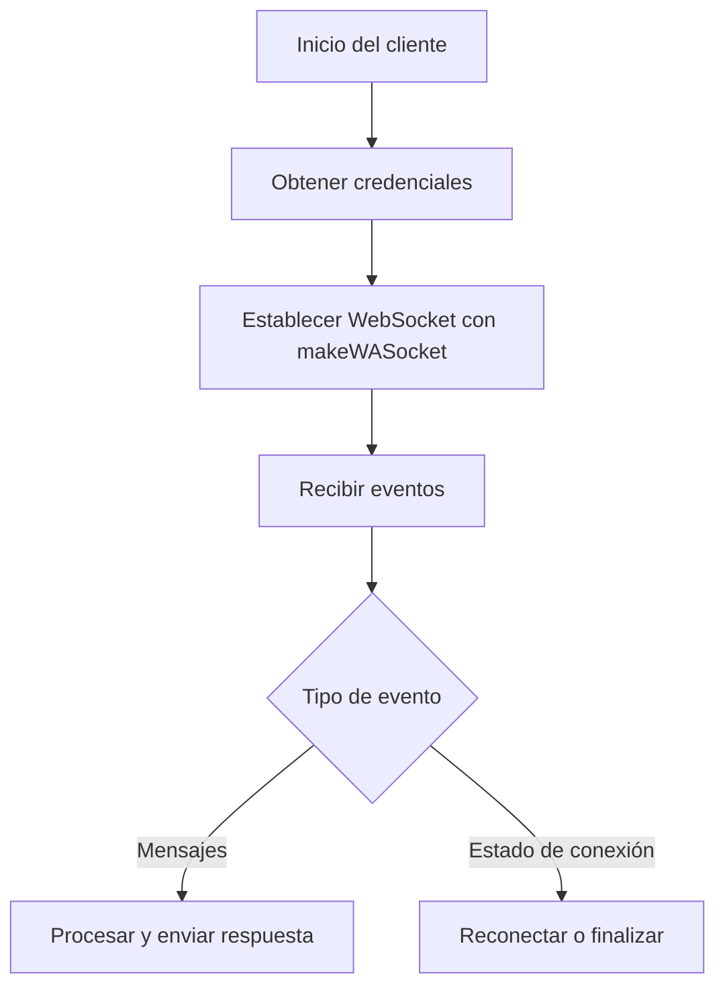

# Visión general del proyecto

Baileys es una biblioteca escrita en TypeScript que permite interactuar con WhatsApp Web mediante WebSockets. Proporciona una API tipada para crear sesiones, enviar y recibir mensajes y administrar eventos del protocolo.

La organización principal del código es la siguiente:

- **src/**: contiene la implementación central de la biblioteca, incluyendo el manejo de sockets, utilidades, tipos y funciones por defecto.
- **Example/**: provee un ejemplo funcional que muestra cómo iniciar una sesión y reaccionar a los eventos de WhatsApp.
- **WAProto/**: alberga las definiciones de mensajes Protobuf utilizados para comunicarse con el servidor de WhatsApp.
- **Media/**, **proto-extract/** y otros directorios contienen recursos auxiliares y herramientas de desarrollo.

Esta documentación busca facilitar la migración de la biblioteca a otro lenguaje, en particular a Go, describiendo los flujos principales y la tecnología involucrada.

## Flujo general del proyecto

