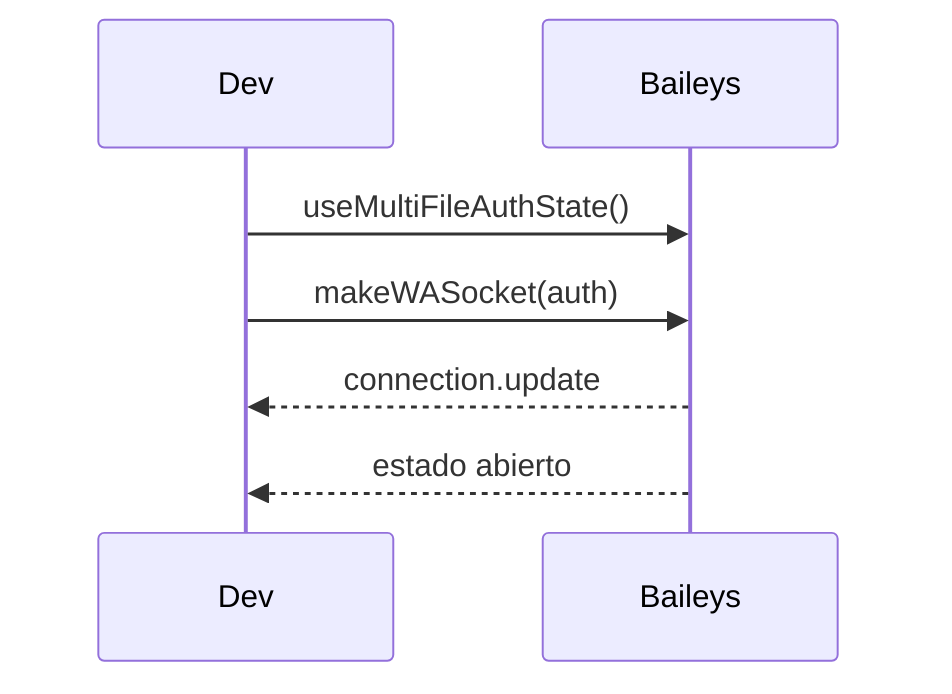

# Evento: creación de sesión

Este evento describe el proceso para iniciar una conexión nueva con WhatsApp.

1. Se obtienen o generan credenciales mediante `useMultiFileAuthState`.
2. Se invoca `makeWASocket` con las credenciales y configuraciones necesarias.
3. El socket emite `connection.update` para notificar cambios de estado.
4. Si la conexión se cierra y no es por cierre voluntario, se intenta reconectar.

## Diagrama de flujo

