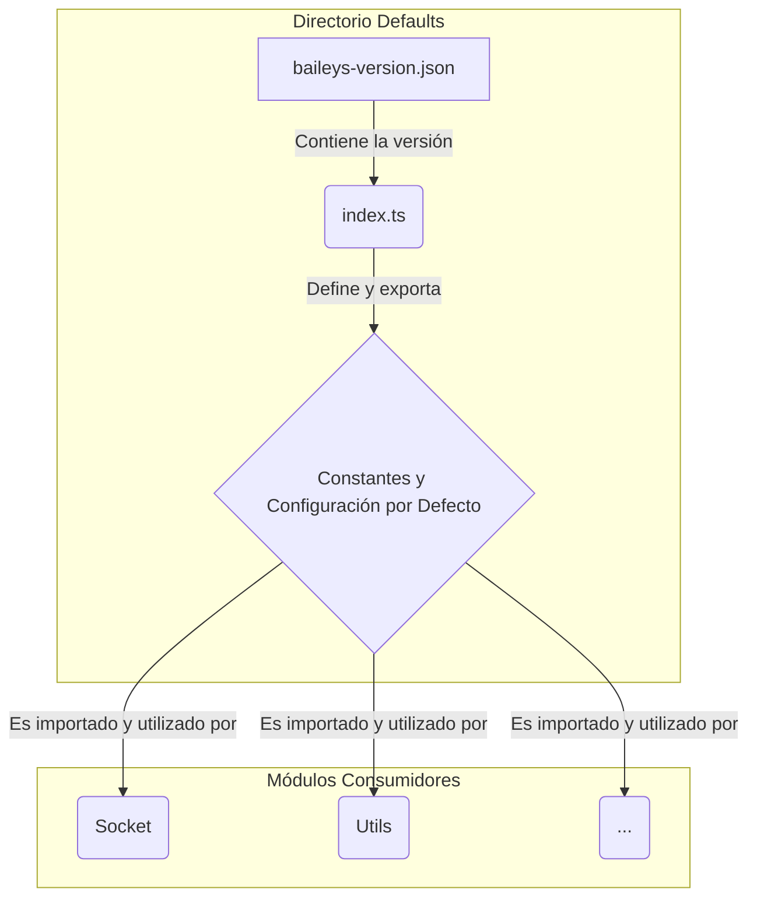

# Diagrama del Directorio `src/Defaults`

Este diagrama ilustra cómo se estructura y se utiliza el contenido del directorio `Defaults`. Dado que este módulo se compone principalmente de constantes y configuraciones, el "flujo" consiste en la exportación de estos valores para ser consumidos por otras partes del sistema.

## Explicación del Diagrama

1.  **`baileys-version.json`**: Este archivo contiene un dato estático: la versión del cliente que se simula.
2.  **`index.ts`**: Actúa como el punto central del módulo. Lee la versión del archivo JSON y la combina con un gran conjunto de constantes predefinidas (URLs, timeouts, claves de protocolo, etc.) en un único objeto de configuración (`DEFAULT_CONNECTION_CONFIG`) y varias constantes exportadas.
3.  **Constantes y Configuración por Defecto**: Este es el "producto" del módulo. Es un conjunto de valores listos para ser importados.
4.  **Módulos Consumidores**: Otros módulos de la aplicación, principalmente `Socket`, pero también `Utils` y otros, importan la configuración y las constantes desde `Defaults/index.ts` para inicializar sus propios estados y lógicas. Por ejemplo, cuando se crea una nueva instancia de `Socket` sin una configuración personalizada, esta utilizará `DEFAULT_CONNECTION_CONFIG` de este módulo.
