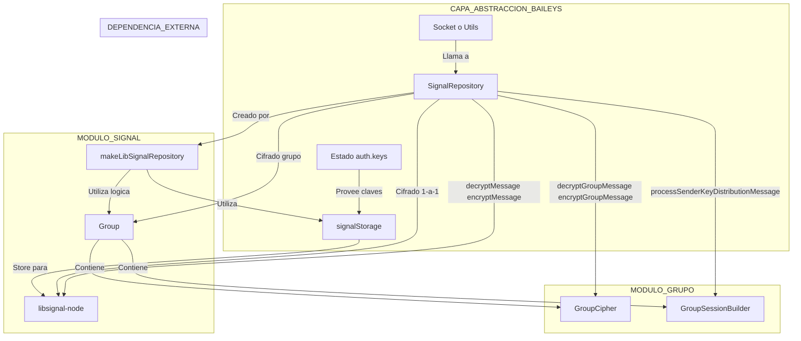

[🏠 Volver al Índice](../navigation.md)

---

# Diagrama del Directorio `src/Signal`

Este diagrama de Mermaid ilustra el flujo de trabajo y las interacciones dentro del módulo `Signal`, mostrando cómo se maneja el cifrado para mensajes individuales y de grupo.

## Explicación del Diagrama

1.  **Punto de Entrada**: Una parte externa de la aplicación (generalmente el `Socket`) necesita realizar una operación de cifrado/descifrado. Para ello, interactúa con el objeto `SignalRepository`.

2.  **`makeLibSignalRepository`**: Esta es la función fábrica que crea el `SignalRepository`. Para hacerlo, necesita el estado de autenticación (`auth`), que contiene todas las claves criptográficas guardadas.

3.  **`signalStorage`**: Esta función interna es crucial. `makeLibSignalRepository` la utiliza para crear un "almacén" (`store`) que es compatible con lo que la librería externa `libsignal-node` espera. Este almacén actúa como un puente, traduciendo las solicitudes de `libsignal-node` para guardar o cargar claves (`storeSession`, `loadPreKey`, etc.) en operaciones sobre el objeto `auth.keys` de Baileys.

4.  **`SignalRepository`**: Es el objeto principal que orquesta las operaciones. Actúa como una fachada (`Facade Pattern`):
    - Si la operación es para un **chat individual** (ej. `encryptMessage`), delega la llamada directamente a la librería `libsignal-node`, que utilizará el `signalStorage` para acceder a las claves necesarias.
    - Si la operación es para un **chat de grupo** (ej. `encryptGroupMessage`), delega la llamada a la lógica implementada en el subdirectorio `Group/`, específicamente a clases como `GroupCipher`.

5.  **Directorio `Group/`**: Contiene la implementación del protocolo de cifrado para grupos (basado en `Sender Keys`). `GroupCipher` se encarga de las operaciones de cifrado/descifrado, mientras que `GroupSessionBuilder` gestiona la creación y actualización de las sesiones de cifrado del grupo.

En resumen, el `SignalRepository` de Baileys centraliza y simplifica el acceso a la funcionalidad criptográfica, decidiendo si usar la librería `libsignal-node` directamente (para 1-a-1) o la lógica personalizada del directorio `Group/` (para grupos), mientras que `signalStorage` se asegura de que ambas vías puedan acceder a las claves almacenadas de forma consistente.
