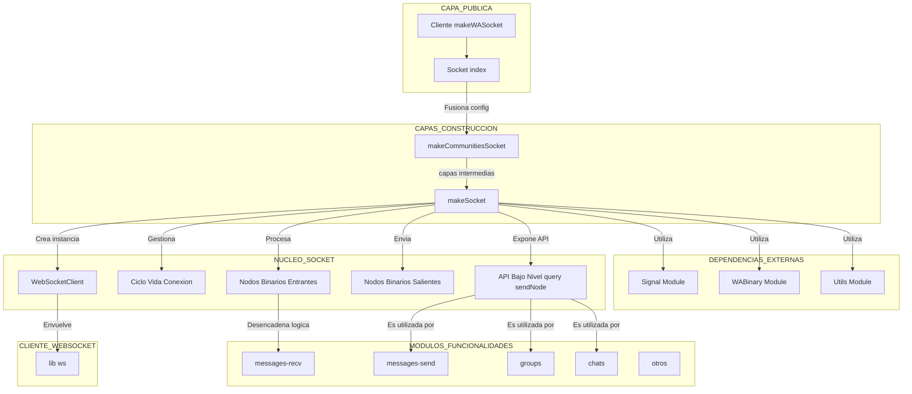

[🏠 Volver al Índice](../navigation.md)

---

# Diagrama del Directorio `src/Socket`

Este diagrama de Mermaid ilustra la arquitectura en capas y el flujo de control dentro del módulo `Socket`. Muestra cómo se construye el socket y cómo las diferentes partes interactúan para gestionar la comunicación.

## Explicación del Diagrama

Este diagrama muestra una arquitectura de "cebolla" o en capas para la creación y operación del socket.

1.  **Punto de Entrada (`index.ts`)**: El proceso comienza cuando el usuario de la librería llama a la función `makeWASocket` exportada por `index.ts`. Esta función se encarga de tomar la configuración del usuario, mezclarla con la configuración por defecto y pasarla a la siguiente capa.

2.  **Capas de Construcción**: Baileys utiliza un patrón de "fábrica en capas". `makeWASocket` no crea el socket directamente, sino que llama a otra función (ej. `makeCommunitiesSocket`), que a su vez puede llamar a otra. Cada capa agrega un conjunto de funcionalidades (ej. manejo de grupos, chats, comunidades) al socket base. La última capa en esta cadena es `makeSocket`.

3.  **Núcleo del Socket (`socket.ts`)**: La función `makeSocket` es el corazón de la comunicación.
    - Crea una instancia del `WebSocketClient` para manejar la conexión de bajo nivel.
    - Gestiona el ciclo de vida completo: el handshake criptográfico con Noise (`validateConnection`), el mantenimiento de la sesión (`keep-alive`), y la desconexión (`end`).
    - Utiliza `WABinary` para codificar/decodificar los mensajes y `Signal` para cifrarlos/descifrarlos.
    - Proporciona una API de bajo nivel (`query`, `sendNode`) que las capas de funcionalidades utilizan para enviar datos.
    - Recibe todos los datos del WebSocket (`onMessageReceived`) y los emite como eventos internos.

4.  **Cliente WebSocket (`Client/websocket.ts`)**: Es la capa más baja. `WebSocketClient` es una simple envoltura alrededor de la librería `ws` de Node.js, abstrayendo la interacción directa con el WebSocket.

5.  **Módulos de Funcionalidades**: Estos son los archivos como `messages-send.ts`, `groups.ts`, etc. Actúan como las capas externas de la "cebolla".
    - **Para enviar datos**: Utilizan la API de bajo nivel expuesta por `makeSocket` (ej. `query`) para enviar sus solicitudes específicas. Por ejemplo, `groups.ts` construiría el `BinaryNode` correcto para "crear un grupo" y lo enviaría usando `query`.
    - **Para recibir datos**: Escuchan los eventos emitidos por el núcleo del socket (que se originan en `onMessageReceived`) para actuar sobre los datos entrantes. Por ejemplo, `messages-recv.ts` escucharía un evento de "nuevo mensaje" para procesarlo.

Este diseño separa claramente las preocupaciones: el núcleo (`socket.ts`) se enfoca en la comunicación y el cifrado, mientras que los otros archivos se enfocan en la lógica de negocio para cada característica de WhatsApp.
