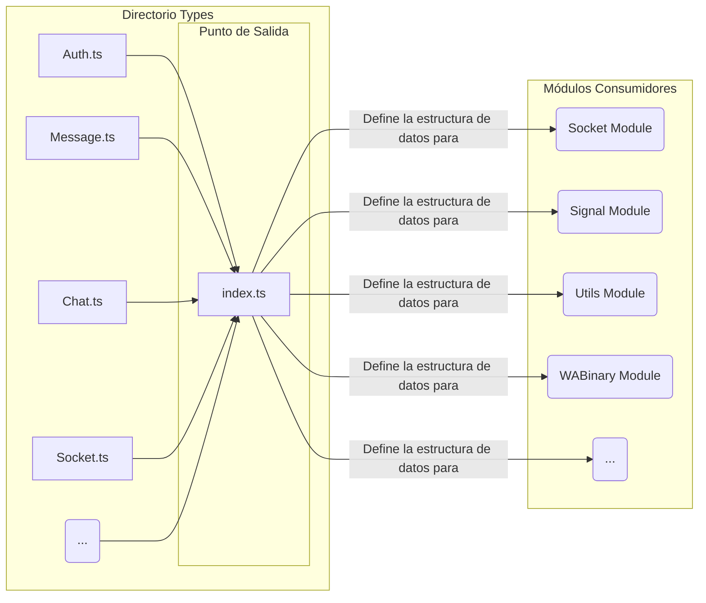

[🏠 Volver al Índice](../navigation.md)

---

# Diagrama del Directorio `src/Types`

Este diagrama es conceptual y muestra el rol del directorio `Types` como una dependencia fundamental y transversal para casi todos los demás módulos del proyecto. No representa un flujo de ejecución, sino un flujo de dependencias.

## Explicación del Diagrama

1.  **Archivos de Definición**: Dentro del directorio `Types`, existen múltiples archivos `.ts` (`Auth.ts`, `Message.ts`, etc.), cada uno especializado en definir las interfaces y tipos para un dominio específico de la aplicación.

2.  **`index.ts` (Archivo Barril)**: Este archivo actúa como la única puerta de salida para todas las definiciones de tipos. Utiliza la sintaxis `export * from '...'` para agrupar y re-exportar todo lo definido en los otros archivos.

3.  **Módulos Consumidores**: Prácticamente todos los demás módulos con lógica de negocio (`Socket`, `Signal`, `Utils`, etc.) importan los tipos que necesitan desde el directorio `Types` (a través de su `index.ts`).

El rol de este directorio es, por lo tanto, el de un **diccionario de datos centralizado**. No ejecuta código, pero impone un "contrato" sobre la forma de los datos que se manipulan en todo el sistema. Esto es crucial para que, por ejemplo, el módulo `Socket` y el módulo `Signal` "entiendan" de la misma manera qué es un objeto `AuthenticationState`, ya que ambos importan su definición desde `Types/Auth.ts`.
