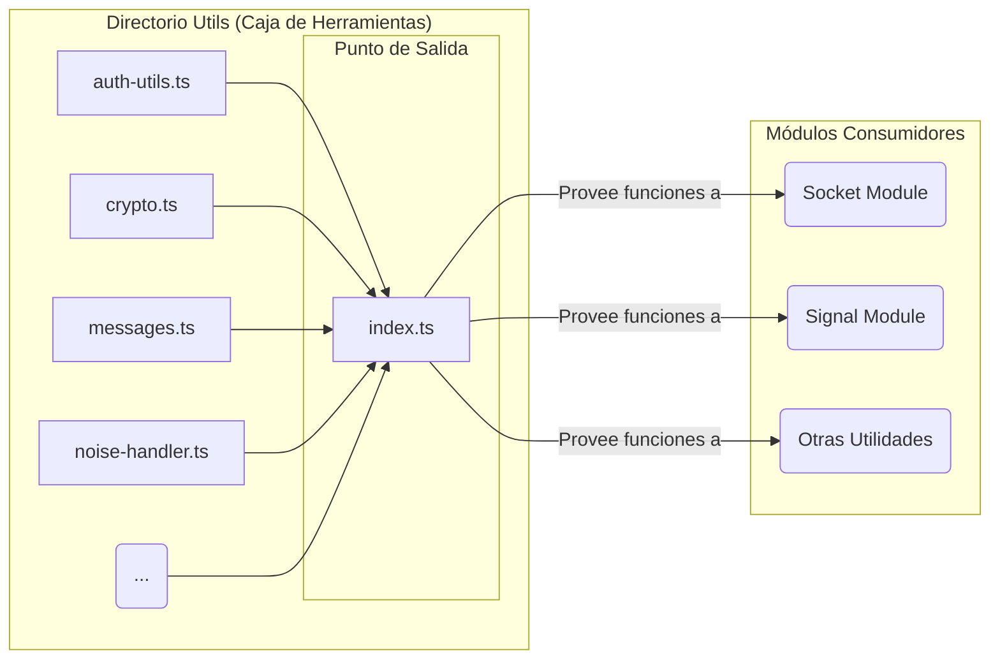

# Diagrama del Directorio `src/Utils`

Este diagrama conceptual ilustra el rol del directorio `Utils` como una "caja de herramientas" compartida, de la cual dependen los principales módulos de lógica del proyecto.

## Explicación del Diagrama

1.  **Archivos de Utilidades**: Dentro del directorio `Utils`, cada archivo `.ts` se especializa en un conjunto de funciones auxiliares. Por ejemplo, `crypto.ts` contiene funciones para la encriptación, y `auth-utils.ts` para la lógica de autenticación.

2.  **`index.ts` (Archivo Barril)**: Este archivo actúa como la fachada del módulo. Agrupa y re-exporta todas las funciones y clases de los archivos de utilidad individuales. Esto permite que el resto de la aplicación importe cualquier función de utilidad desde una única ubicación (`@/Utils`), sin necesidad de conocer el archivo específico donde reside.

3.  **Módulos Consumidores**: Los módulos principales que contienen la lógica de negocio, como `Socket` y `Signal`, son los principales consumidores de estas utilidades.
    - El módulo `Socket` depende en gran medida de `Utils` para tareas como:
      - Manejar el handshake de Noise (`noise-handler.ts`).
      - Validar la conexión y generar nodos de login (`validate-connection.ts`).
      - Procesar mensajes recibidos (`process-message.ts`).
      - Gestionar el buffer de eventos (`event-buffer.ts`).
    - El módulo `Signal` puede utilizar funciones de `crypto.ts` o `signal.ts` para tareas auxiliares.
    - Incluso otras utilidades pueden depender de funciones definidas en sus archivos hermanos.

En esencia, `Utils` no tiene un flujo de ejecución propio, sino que proporciona los "ladrillos" de lógica reutilizable con los que se construyen los flujos más complejos en otros módulos. Es un pilar de apoyo para todo el sistema, promoviendo un código más limpio y modular.
