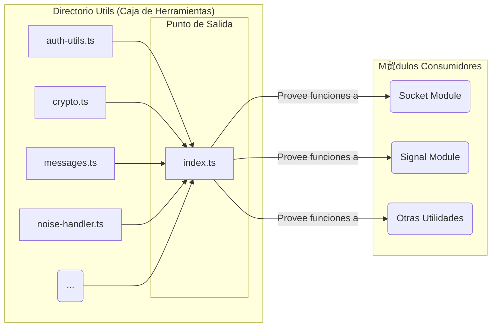

[ Volver al ndice](../navigation.md)

---

# Diagrama del Directorio `src/Utils`

Este diagrama conceptual ilustra el rol del directorio `Utils` como una "caja de herramientas" compartida, de la cual dependen los principales m贸dulos de l贸gica del proyecto.

```mermaid
graph LR
    subgraph "Directorio Utils (Caja de Herramientas)"
        A[auth-utils.ts];
        B[crypto.ts];
        C[messages.ts];
        D[noise-handler.ts];
        E(...);

        subgraph "Punto de Salida"
            F[index.ts];
        end

        A --> F;
        B --> F;
        C --> F;
        D --> F;
        E --> F;
    end

    subgraph "M贸dulos Consumidores"
        G(Socket Module);
        H(Signal Module);
        I(Otras Utilidades);
    end

    F -- Provee funciones a --> G;
    F -- Provee funciones a --> H;
    F -- Provee funciones a --> I;

```

## Explicaci贸n del Diagrama

1.  **Archivos de Utilidades**: Dentro del directorio `Utils`, cada archivo `.ts` se especializa en un conjunto de funciones auxiliares. Por ejemplo, `crypto.ts` contiene funciones para la encriptaci贸n, y `auth-utils.ts` para la l贸gica de autenticaci贸n.

2.  **`index.ts` (Archivo Barril)**: Este archivo act煤a como la fachada del m贸dulo. Agrupa y re-exporta todas las funciones y clases de los archivos de utilidad individuales. Esto permite que el resto de la aplicaci贸n importe cualquier funci贸n de utilidad desde una 煤nica ubicaci贸n (`@/Utils`), sin necesidad de conocer el archivo espec铆fico donde reside.

3.  **M贸dulos Consumidores**: Los m贸dulos principales que contienen la l贸gica de negocio, como `Socket` y `Signal`, son los principales consumidores de estas utilidades.
    - El m贸dulo `Socket` depende en gran medida de `Utils` para tareas como:
      - Manejar el handshake de Noise (`noise-handler.ts`).
      - Validar la conexi贸n y generar nodos de login (`validate-connection.ts`).
      - Procesar mensajes recibidos (`process-message.ts`).
      - Gestionar el buffer de eventos (`event-buffer.ts`).
    - El m贸dulo `Signal` puede utilizar funciones de `crypto.ts` o `signal.ts` para tareas auxiliares.
    - Incluso otras utilidades pueden depender de funciones definidas en sus archivos hermanos.

En esencia, `Utils` no tiene un flujo de ejecuci贸n propio, sino que proporciona los "ladrillos" de l贸gica reutilizable con los que se construyen los flujos m谩s complejos en otros m贸dulos. Es un pilar de apoyo para todo el sistema, promoviendo un c贸digo m谩s limpio y modular.
