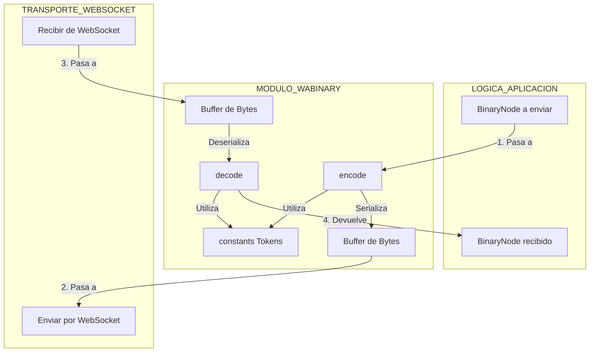

[🏠 Volver al Índice](../navigation.md)

---

# Diagrama del Directorio `src/WABinary`

Este diagrama ilustra el flujo de datos a través del módulo `WABinary`, mostrando cómo actúa como una capa de traducción entre los objetos `BinaryNode` utilizados por la aplicación y los `Buffers` de bytes que se transmiten por la red.

## Explicación del Flujo

Este módulo tiene dos flujos principales y opuestos:

### 1. Flujo de Codificación (Mensaje Saliente)

- **Paso 1**: Cuando un módulo de alto nivel como `Socket` necesita enviar un comando al servidor de WhatsApp, construye un objeto `BinaryNode` que representa ese comando. Este objeto se pasa a la función `encodeBinaryNode` en `encode.ts`.
- **Paso 2**: `encode.ts` recorre la estructura del `BinaryNode`. Para cada cadena de texto (en etiquetas, atributos o contenido), consulta los diccionarios en `constants.ts` para ver si puede reemplazarla con un "token" más corto. Luego, serializa toda la estructura en un `Buffer` de bytes.
- **Paso 3**: El `Buffer` resultante es lo que se envía a través del WebSocket.

### 2. Flujo de Decodificación (Mensaje Entrante)

- **Paso 4**: El WebSocket recibe un `Buffer` de bytes del servidor. Este buffer se pasa a la función `decodeBinaryNode` en `decode.ts`.
- **Paso 5**: `decode.ts` lee el `Buffer` byte a byte. Cuando encuentra un byte o par de bytes que corresponden a un "token", utiliza `constants.ts` para buscar la cadena de texto original. Reconstruye la estructura del `BinaryNode` en memoria.
- **Paso 6**: El objeto `BinaryNode` reconstruido es devuelto al `Socket`, que ahora puede inspeccionar su `tag`, `attrs` y `content` para entender qué comando o mensaje ha enviado el servidor y actuar en consecuencia.

En esencia, `WABinary` es una capa de traducción fundamental que permite a la aplicación trabajar con objetos estructurados (`BinaryNode`) mientras se comunica a través de la red de la manera más eficiente posible, gracias a las optimizaciones de tokenización y empaquetado.
