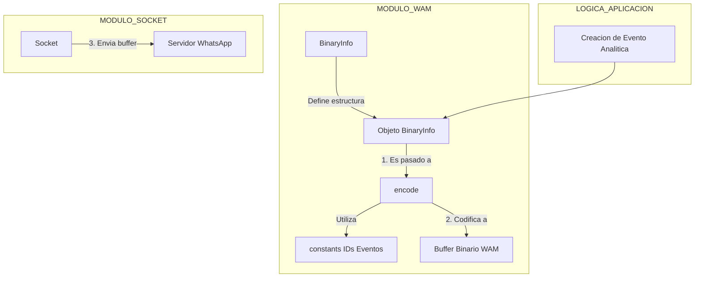

[ Volver al ndice](../navigation.md)

---

# Diagrama del Directorio `src/WAM`

Este diagrama ilustra el flujo de datos para la codificaci贸n de un evento de anal铆tica (WAM), desde la creaci贸n de los datos del evento hasta la generaci贸n del buffer binario final.

```mermaid
flowchart TD
    subgraph LOGICA_APLICACION
        A[Creacion de Evento Analitica]
    end

    subgraph MODULO_WAM
        B[BinaryInfo] -- Define estructura --> C[Objeto BinaryInfo]
        D[encode] -- Utiliza --> E[constants IDs Eventos]
        C -- 1. Es pasado a --> D
        D -- 2. Codifica a --> F[Buffer Binario WAM]
    end

    subgraph MODULO_SOCKET
        G[Socket] -- 3. Envia buffer --> H[Servidor WhatsApp]
    end

    A --> C
```

## Explicaci贸n del Flujo

El proceso es lineal y se centra en la codificaci贸n:

1.  **Creaci贸n de Datos del Evento**: En alguna parte de la aplicaci贸n, se decide que se debe registrar un evento de anal铆tica (por ejemplo, "se ha enviado un mensaje de tipo imagen"). Se crea un objeto `BinaryInfo` (cuya clase se define en `BinaryInfo.ts`) y se puebla con los detalles de este evento.

2.  **Paso al Codificador**: Este objeto `BinaryInfo` se pasa a la funci贸n principal `encodeWAM` del archivo `encode.ts`.

3.  **Codificaci贸n**: La funci贸n `encodeWAM` recorre la estructura del objeto `BinaryInfo`.
    - Para cada evento y cada propiedad, busca su ID num茅rico correspondiente en los arrays `WEB_EVENTS` y `WEB_GLOBALS` definidos en `constants.ts`.
    - Utiliza la l贸gica en `serializeData` para convertir los valores del evento (cadenas, n煤meros) en su representaci贸n binaria m谩s eficiente.
    - Ensambla todos estos bytes en un 煤nico `Buffer`.

4.  **Env铆o**: El `Buffer` binario resultante es devuelto al m贸dulo `Socket`, que luego lo envuelve en un nodo `iq` (query) y lo env铆a a los servidores de WhatsApp.

En resumen, el m贸dulo `WAM` act煤a como un **serializador especializado**. Su 煤nica funci贸n es tomar datos de anal铆tica estructurados y convertirlos al formato binario compacto que WhatsApp espera, utilizando un diccionario de constantes para mapear nombres de eventos y propiedades a IDs num茅ricos.
