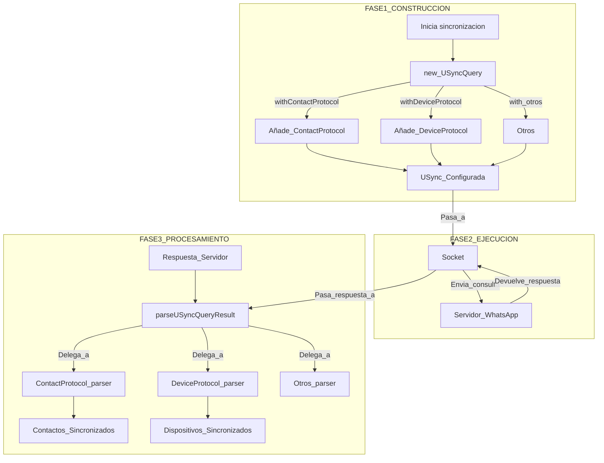

[🏠 Volver al Índice](../navigation.md)

---

# Diagrama del Directorio `src/WAUSync`

Este diagrama ilustra el flujo de trabajo para realizar una consulta de sincronización de usuario (USync), desde la construcción de la solicitud hasta el procesamiento de la respuesta.

## Explicación del Flujo

El proceso de USync sigue un patrón de **Builder** y **Strategy**.

1.  **Construcción (Builder Pattern)**:
    - Un cliente (probablemente el `Socket` o una lógica de alto nivel) crea una instancia de `USyncQuery`.
    - Utiliza los métodos encadenados (`.with...Protocol()`) para "construir" la consulta, especificando qué tipos de datos desea sincronizar. Cada llamada a estos métodos añade un objeto de protocolo (ej. `USyncContactProtocol`) a una lista interna en el objeto `USyncQuery`.

2.  **Ejecución**:
    - El objeto `USyncQuery` configurado se utiliza para generar un `BinaryNode` de solicitud (la lógica exacta de la generación está probablemente en `USyncUser.ts` o en el módulo `Socket`).
    - El `Socket` envía esta solicitud al servidor de WhatsApp y espera la respuesta.

3.  **Procesamiento (Strategy Pattern)**:
    - La respuesta del servidor (otro `BinaryNode`) se pasa al método `parseUSyncQueryResult` del objeto `USyncQuery` original.
    - Este método recorre la respuesta. Para cada sección de la respuesta (ej. la sección de contactos), busca el objeto de protocolo correspondiente que se registró en la fase de construcción.
    - Llama al método `parser` de ese objeto de protocolo. Cada objeto de protocolo actúa como una **estrategia** que sabe exactamente cómo interpretar su parte específica de la respuesta.
    - El resultado es un conjunto de datos estructurados y sincronizados que la aplicación puede utilizar.

Este diseño es muy modular y extensible. Para soportar la sincronización de un nuevo tipo de datos, solo se necesitaría crear una nueva clase de protocolo e implementarle un `parser`, sin tener que modificar el constructor de consultas principal.
