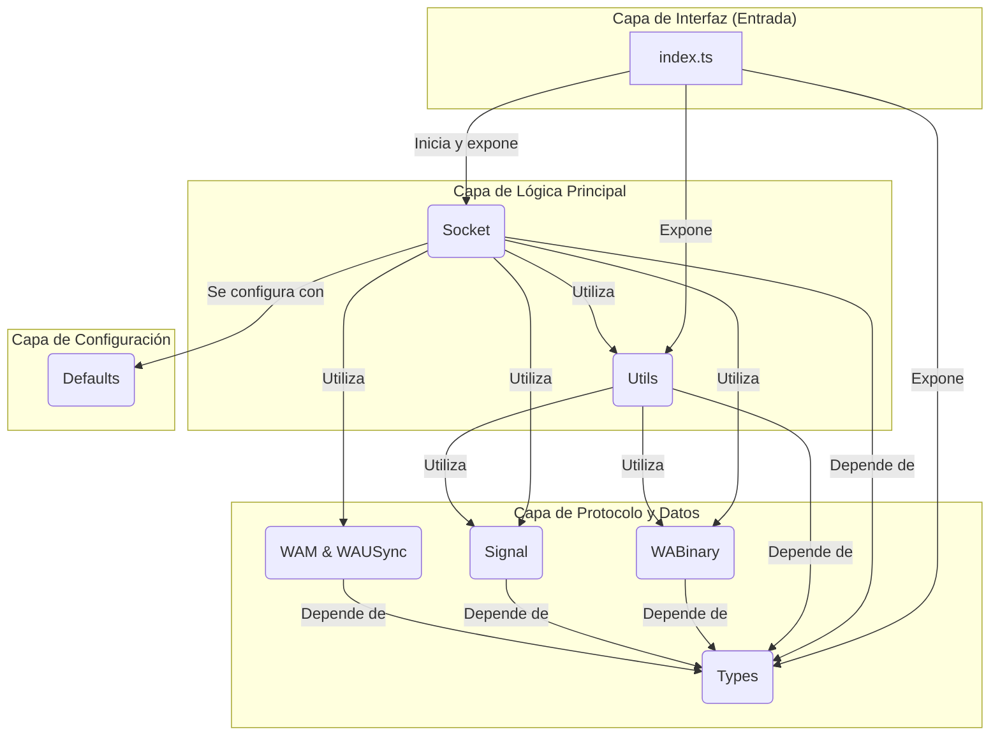

# Diagrama de Flujo del Directorio `src`

Este diagrama de Mermaid ilustra la interacción de alto nivel entre los principales módulos (carpetas) dentro del directorio `src`.

## Explicación del Diagrama

1.  **`index.ts` (Punto de Entrada)**:
    - Es el punto de partida. Importa la funcionalidad clave de los otros módulos y la expone al usuario final de la librería. Su función principal es orquestar la creación y configuración del socket.

2.  **`Socket` (Núcleo de Comunicación)**:
    - Es el módulo central. Gestiona la conexión WebSocket, el ciclo de vida de la sesión y el flujo principal de eventos.
    - Para la comunicación, depende de `WABinary` para codificar y decodificar los mensajes binarios.
    - Para la seguridad, utiliza el módulo `Signal` para encriptar y desencriptar el contenido de los mensajes.
    - Se apoya en `Utils` para tareas auxiliares como el manejo de la autenticación, procesamiento de mensajes, etc.
    - Utiliza `WAM` y `WAUSync` para manejar métricas y sincronización de datos.
    - Carga configuraciones iniciales desde `Defaults`.

3.  **`WABinary` y `Signal` (Protocolo y Cifrado)**:
    - `WABinary` traduce los datos a y desde el formato binario específico de WhatsApp.
    - `Signal` maneja todo el proceso de cifrado de extremo a extremo, asegurando que los mensajes sean seguros.

4.  **`Utils` (Utilidades)**:
    - Proporciona funciones de ayuda que son utilizadas por `Socket` y otros módulos. Actúa como una caja de herramientas compartida.

5.  **`Types` (Definiciones de Datos)**:
    - Es un módulo transversal del que dependen casi todos los demás. Define las "formas" (interfaces, tipos) de los objetos que se manejan en la aplicación (mensajes, chats, contactos, etc.), garantizando la coherencia en todo el código.

6.  **`Defaults` (Configuración)**:
    - Proporciona valores por defecto que el módulo `Socket` utiliza para inicializar la conexión si no se especifican otras configuraciones.

En resumen, el flujo es el siguiente: `index.ts` crea una instancia de `Socket`. El `Socket` utiliza `WABinary` y `Signal` para comunicarse de forma segura, se apoya en `Utils` para lógica reutilizable y en `Types` para la estructura de datos. Todo el sistema se inicia con valores de `Defaults`.
